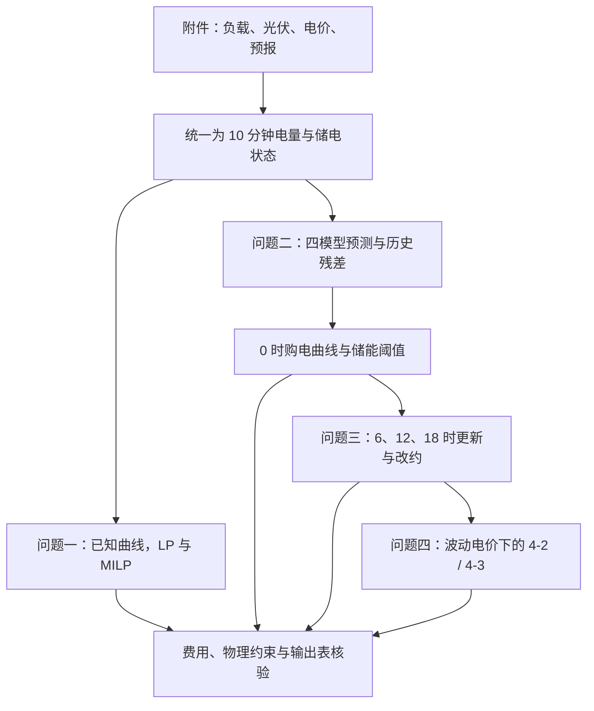
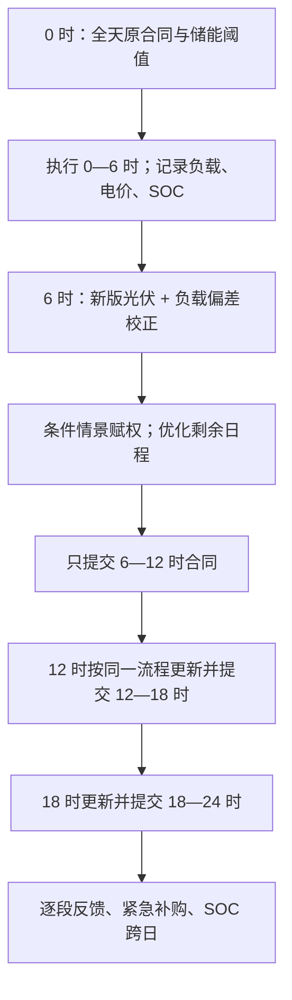
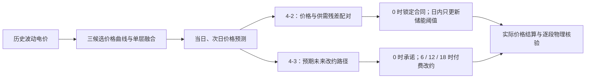

# 研究导读：预测、储能反馈与微网购电优化

本文件是[最终论文](../paper/final_paper.pdf)的网页版导读，供 GitHub 无法预览 PDF 时阅读。它按论文的问题一至四梳理研究问题、决策时可用的信息、模型机制、主要结果和对应代码。金额均为**论文交付版本**的结果；公开脚本在其他软件环境下重新运行可能出现小幅差异，见[复现说明](reproduce.md)。

## 先看整体问题

微网同时面对负载、光伏、外网电价与储能。每个 10 分钟区间都必须满足供需平衡；电池可把富余光伏或低价电转移到后续区间。题目逐步增加不确定性和交易权限：

| 部分 | 0 时已知的信息 | 日内可做的事 | 核心问题 |
| --- | --- | --- | --- |
| 问题一 | 典型日负载、光伏、电价 | 按已知曲线执行 | 确定性最优购电和储能调度 |
| 问题二 | 历史负载与光伏、固定分时电价 | 固定合同，电池反馈；缺口高价补购 | 如何把预测误差转成购电与储能风险 |
| 问题三 | 问题二的信息及分时发布的光伏预报 | 6、12、18 时可付费改约 | 新预报、当天偏差和改约费用如何联动 |
| 问题四 | 问题二、三的信息及历史波动电价 | 4-2 固定合同；4-3 可改约 | 价格预测和交易权限如何改变决策 |



## 共同物理口径与费用口径

附件的功率单位为 kW；每段长 1/6 小时，因此区间电量等于功率乘以 1/6，单位为 kWh。每天有 144 段。以净需求电量 n = (负载功率 − 光伏功率) / 6 表示母线在扣除光伏后的需求，核心关系为：

```text
常规购电 + 电池放电 + 紧急购电 = 净需求 + 电池充电 + 未利用电量
期末储电量 = 期初储电量 + 0.9 × 充电量 − 放电量 / 0.9
1,200 ≤ 储电量 ≤ 10,800 kWh；单段充电、放电各不超过 5,000 / 6 kWh
同一十分钟段禁止同时充电和放电
```

问题一的未利用电量对应弃光；后续问题的未利用电量还可能包括已购但未使用的电，因此不能全部称为弃光。问题一要求日末储电量回到 6,000 kWh；问题二至四把实际期末状态传给次日，**不逐日重置**。所有方案均不向外网售电。规划目标中的期末储电价值用于避免短视放电，**不是现金收入**；论文报告的总费用按实际购电和结算规则计算。

## 问题一：确定性调度

典型日的负载、给定光伏预测和分时电价都已知。模型以全天计划购电费最小为目标，同时满足每段供需平衡、储电递推、容量与功率限制，以及日初和日末同为 6,000 kWh。

先用线性规划（LP）求解连续变量，再用一个二元充放电模式变量为每段增加互斥约束，形成混合整数线性规划（MILP）。此例中 LP 解本身就没有同时充放电，因而也满足 MILP 可行性；两种模型均给出 **35,126.95 元**，较无储能方案降低 **26.90%**。这项最优性结论只属于问题一的确定性模型。

代码入口是 [q1_complete.py](../code/q1_complete.py)：**read_attachment1** 校验 144 个时间段与输入，**solve_dispatch** 构造并求解 LP / MILP，**write_result_workbook** 写入原始结果模板，**write_supporting_files** 导出区间明细与时间映射。论文的时间标签采用右端点，如 00:10 对应 00:00—00:10；代码明确核验这种映射，避免模板列错位。

## 问题二：日前预测、情景与储能反馈

### 1. 分别预测负载与光伏

只预测净需求会掩盖负载与光伏的不同规律。论文先对两者分别生成四条基础预测曲线，再单层融合：

| 基础模型 | 捕捉的信息 |
| --- | --- |
| 日更 LightGBM | 近期滞后、星期与日内变化的非线性关系 |
| 日更 Ridge | 同一组历史特征的线性与正则化基准 |
| 周期残差 LightGBM | 历史日曲线平滑后的局部偏差 |
| 日历曲线 Ridge | 年内季节位置和整日形态 |

日更模型的特征包括 1、2、3、7、14 日前同刻功率及滑动统计；模型配置按此前误差在月初选择，参数仍逐日更新。融合权重非负、和为 1；负载和光伏分别估计，并适度收缩到等权组合。28 日和 56 日融合窗口按已完成日期的误差选择。预测对象的未来实际值不进入当日权重计算。

### 2. 把历史误差变成整日情景

先合成十分钟净需求预测，再取已完成日期的“实际净需求 − 当时预测”整日残差。最近至多 56 日中最多选 28 条完整残差路径，按 14 日半衰期赋权，并将整条残差加到目标日预测。这样，一天内连续高估或低估的形状会进入储能仿真。

高价紧急购电为普通电价的 5 倍。在**无储能单时段**的简化问题中，预购量的临界分位数是 1 − 1/5 = **0.8**。论文据此建立初始风险曲线；储能会跨时段转移能量，因此 0.8 只是完整模型的初始化依据，**不是多时段全局最优分位数**。

### 3. 从计划走到反馈

风险曲线进入购电与储能规划，生成 0 时购电起点。求解时先尝试 LP 松弛并检查充放电互斥。随后在 1,200—10,800 kWh 之间以 50 kWh 网格做动态规划（DP），为每个十分钟段计算放电保留阈值：

```text
如果实际净需求高于已购电量：只释放高于保留阈值、且不超过功率上限的电量；
仍不足的部分按 5 倍价格紧急购电。
如果实际净需求低于已购电量：优先在容量内给电池充电；
无法利用的剩余电量记为未利用电量。
```

初始购电曲线与上述反馈策略不一定协调。模型按六个四小时块局部修正购电曲线，让每条历史情景都用同一阈值规则实际“走一遍”；只有情景规划目标下降时才接受修改，再重算阈值。这里的“闭环”指**0 时计划评价已考虑日内反馈和状态变化**，合同本身在日内仍固定。


1 月 1—15 日作为初始准备期，1 月 16—31 日预运行；正式评价为 2025 年 2 月 1 日至 12 月 31 日 **334 天、48,096 个区间**。论文交付总费用 **13,475,274.43 元**，其中紧急购电费 **526,386.22 元**；正式区间净负荷预测 WAPE 为 **7.624%**。

关键代码在 [q2_complete.py](../code/q2_complete.py)：**train_component / online_blend** 对应基础预测与融合；**scenario_set / weighted_quantile** 对应历史情景与购电起点；**dp_reserves / step_action / execute** 对应阈值和逐段物理反馈；**optimize_grid / make_main_plan / replay** 对应闭环计划与全年回放。**load_archived_components** 只读取留档基础预测并核对日期和输入哈希；使用 archive 模式不代表这次重新训练了四个预测器。

## 问题三：预报发布后的滚动改约

0 时先确定全天原计划。6、12、18 时获取新版光伏预报，并根据当天已发生的负载偏差校正剩余时段。光伏外部预报与问题二基础预测作凸组合，权重由**相同发布时间的历史误差**确定；负载校正使用最近一小时及当日累计的已观察偏差，通过小规模 Ridge 回归估计后续六小时块的偏移。

新的中心预测仍不足以描述未来误差。模型按同一发布时间构造历史残差路径，再以“日期接近程度 + 当前已观察状态相似程度”重新赋权；条件权重保留 25% 的时间权重以避免过度集中。合同上调按原价的 1.5 倍新增付费；下调只退还原价的 0.5 倍。规划每次延伸到日末，但**只提交紧接的六小时合同**，已执行区间不会被追改。



日内合同先由分位数规划和粗修正初始化，再逐十分钟细化；每次重新计算 DP 阈值，并只接受规划目标改善的候选。论文主方案总费用为 **13,016,898.13 元**。与**同样使用 0、6、12、18 时预报、但没有负载校正、条件赋权及逐区间细化**的直接扩展基准相比，减少 **77,754.00 元**。论文另比较“仅 0 时”与多时刻更新，二者是不同的对照口径，不能混写为某一个单独预报的收益。

[q3_complete.py](../code/q3_complete.py) 的 **interpolate_release / calibration_weight / predict_load** 实现信息更新，**scenarios** 实现条件情景，**make_adjustment / refine_plan / simulate_day** 实现合同和电池滚动决策，**replay_q3 / verify_dispatch / verify_result3** 负责回放及核验。

## 问题四：波动电价与两种交易权限

价格模块用三条历史候选曲线：上周同刻价格、同星期衰减均值、星期形状与趋势分解；再按此前误差进行非负单层融合。6、12、18 时利用已观察价格偏差校正后续六小时块。次日 0—6 时预测价格的 25% 分位数用于估计日末库存的规划价值；实际费用始终用**实际价格**结算。

**4-2 固定合同**继承问题二的供需模型，0 时锁定全天合同。它把同一天的价格残差和供需残差配成情景，以覆盖“高价时恰好缺电”的风险；日内可以按新价格重算电池阈值，但不能改购电合同。

**4-3 可改约合同**继承问题三的预报更新与条件情景。在 0 时先用最多七条历史预报修订路径模拟未来改约，并用未来合同的加权中位数温和调整日前承诺；6、12、18 时收到真实发布信息后再重新规划和提交下一六小时合同。这个 50% 预期改约修正是启发式设置，不是全局最优证明。



论文交付版本中，4-2 与 4-3 的总费用分别为 **14,132,392.08 元**和 **13,634,348.55 元**。4-3 低 **3.5241%**，差额同时包含交易权限、预报、合同调整与模型机制，不能单独归因于价格预测。4-2 的价格残差配对在其内部对照中节省 5,708.68 元；同样做法用于 4-3 反而使费用增加，因此最终只在 4-2 保留。

[q4_2_complete.py](../code/q4_2_complete.py) 与 [q4_3_complete.py](../code/q4_3_complete.py) 保留提交时的两个独立脚本。关键函数为 **prepare_prices / prepare_price_fusion / intraday_correct**（价格信息），**paired_prices / stock_value**（配对风险与库存价值），**Planner / replay**（各自合同权限下的逐日调度），**audit_arrays / verify_excel**（物理及模板核验）。

## 如何读这些数字与代码

- **论文结果是原交付版本的同年度回放**。历史滚动决策只使用当时已完成的数据，但模型结构及部分设置是在同一个 2025 年样本上开发和比较的；还缺独立跨年度测试。
- 问题二至四使用有限历史情景、50 kWh 的 DP 状态网格与局部曲线优化，属于近似策略；不能把“完整回放”写成全局最优。
- 逐段储能反馈根据**当前十分钟区间实现的净需求**决定本区间动作，是题目回放中的反馈近似；这些结果不证明在每个区间开始前就能知道本区间实际负载和光伏。
- 费用比较须在相同附件、价格、初始储电量、合同权限和基准模型下进行。固定电价的问题二、三与波动电价的问题四的绝对费用不能直接互相比方法优劣。
- 原始官方附件未收入仓库。[复现说明](reproduce.md)给出目录、逐问命令、archive 与 retrain 的差别及本次核验观察；[数据说明](../data/README.md)给出官方获取入口。
- 代码实现过程中使用了 AI 辅助；论文第 10 节披露了其用途。这是团队竞赛研究，由仓库整理者负责建模与实验分析，不代表已经部署的能源管理系统。
