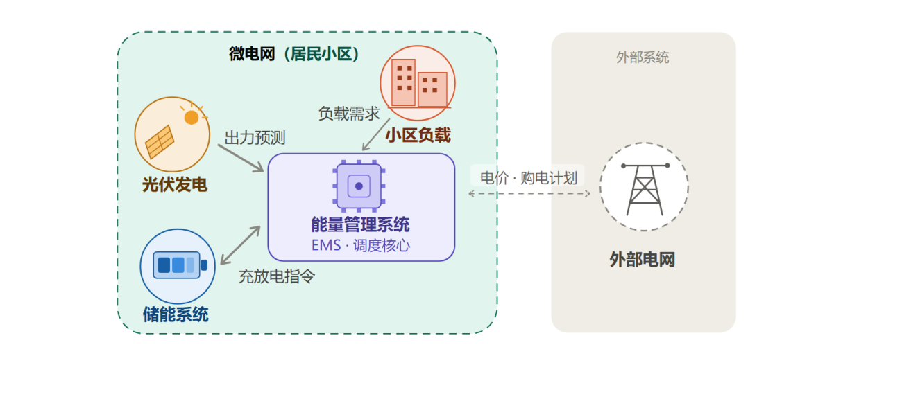
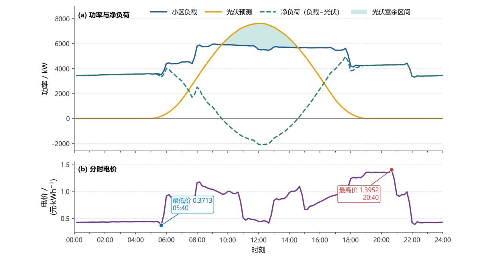
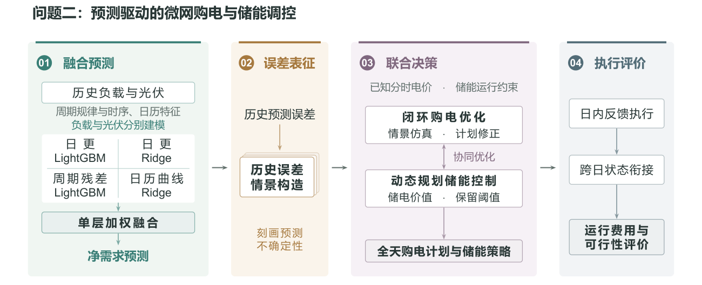
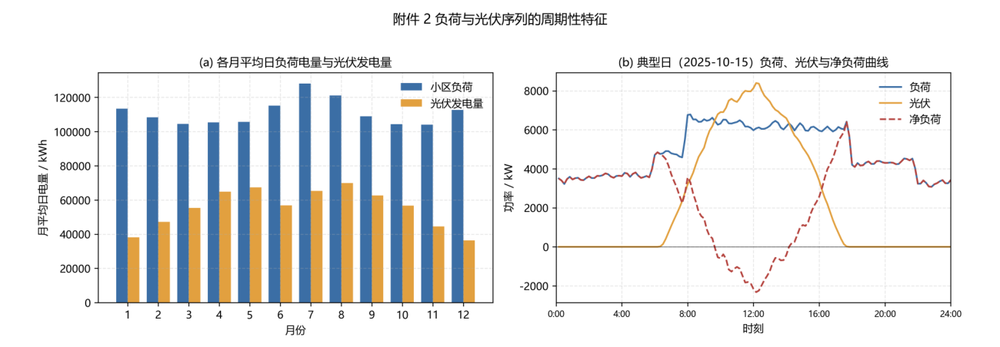
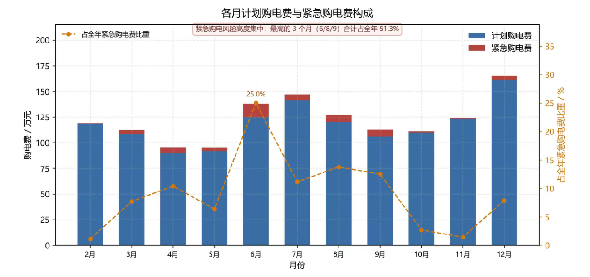
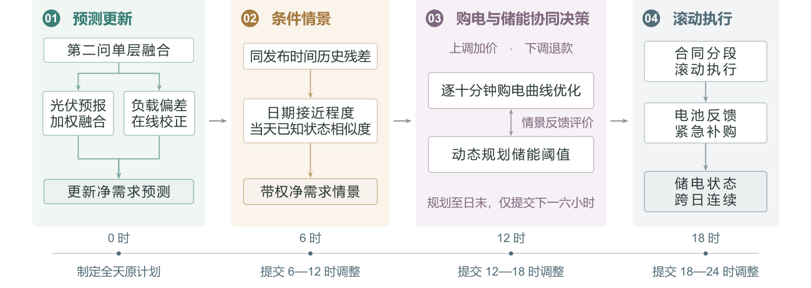
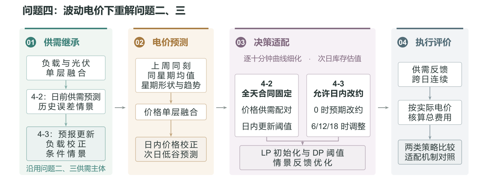
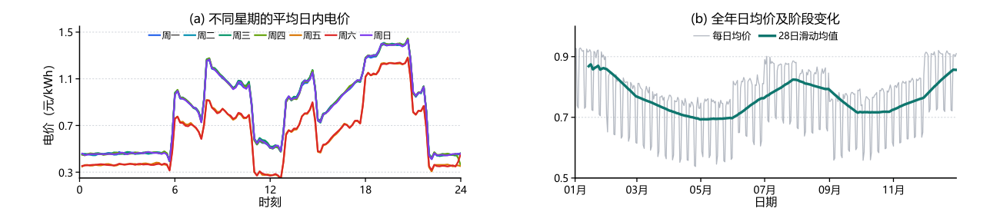

# 预测与储能反馈协同的微网购电优化

## 摘要

针对光伏、负载与电价变化下的微网购电问题，本文以总购电费用最小为目标，在供需平衡与储能约束下，建立由确定性调度向预测驱动、日内调整和波动电价逐步扩展的优化模型。问题二至四均以2025 年2 月至12 月共334 天的数据评价。

针对问题一，引入储能跨时段调节机制与充放电互斥约束，构建确定性购电与储能联合优化的线性规划和混合整数线性规划模型。两模型最优日费用均为35,126.95 元，较不使用储能降低26.90%，且满足供电及日末电量恢复要求。结果表明，储能可利用供需与电价的时段差异降低费用，本算例的线性规划最优解亦满足互斥条件。

针对问题二，引入单层四模型融合预测与历史残差情景，构建购电计划与储能反馈协同优化模型。分别预测负载与光伏，以动态规划确定储能保留阈值，并按情景下的执行费用修正日前购电曲线。总费用为13,475,274.43 元，其中紧急购电费526,386.22元。该方案在0 时固定全天计划，日内通过储能与紧急补购覆盖供需偏差，实现供需未知条件下的连续供电与储电状态跨日衔接。

针对问题三，引入多时刻光伏预报、负载校正与条件情景赋权，构建计及改约费用的日内滚动购电优化模型。0 时制定全天计划，6、12、18 时更新信息，按十分钟区间优化并提交下一六小时合同，总费用为13,016,898.13 元。同一基准框架下，引入三次日内预报并调整购电，较仅采用0 时预报节省231,051.66 元，说明计入改约成本后仍具有经济收益。因此，本题条件下有必要引入0 时以外的预报制定调整购电策略。

针对问题四，引入电价融合预测与日内价格校正，构建波动电价下的购电与储能协同优化模型。重新求解问题二、三时，固定合同方案采用价格与供需残差配对，日内改约方案依据历史修订路径评估未来改约并调整日前承诺。两者总费用分别为14,132,392.08 元和13,634,348.55 元，后者降低3.52%，表明波动电价下应协同考虑价格预测、合同调整与储能估值，日内调整仍具有经济价值。

各方案均通过物理约束及费用核验；上述结果为同年度开发方案的逐日回放表现，跨年度适用性仍需独立数据检验。

关键词：微网购电；单层融合预测；历史残差情景；动态规划；滚动优化

## 1 问题重述

### 1.1 问题背景

随着“双碳”战略推进，以光伏为代表的可再生能源越来越多地接入配电网。但光伏发电具有明显的间歇性与波动性，大规模并网会给电网的调峰、调频带来压力，因此需要尽量在本地把发出来的电能用尽[1,5]。微电网正是一套小型供用电系统，它把本地用电负荷、分布式电源和储能设备整合在一起，实现电力自主平衡与灵活调控。其中能量管理系统（EMS）是实现各类能源安全、高效协同使用的核心[1]。

储能系统是微网中最关键的可调设备。在分时电价机制下，储能可以在电价低谷时充电、在电价高峰时放电，即“峰谷套利”，以此减少微电网的购电成本[2,6]。同时储能还能抵消光伏发电波动、提升光伏利用率[1,2]，其容量、功率与充放电效率等关键指标均有相应的国家标准与国际标准作为参考[3,4]。因此，如何依据小区负载、光伏发电与储能当前储电量等信息，合理安排购电与储能的充放电计划，在保证供电的同时尽可能降低购电成本，成为微网运行中亟待解决的核心问题。



**图1 微电网各主体及其关系示意图**

### 1.2 问题提出

本研究需结合所提供的电价、负载与光伏数据与设备参数，建立微电网计划购电策略的数学模型，以系统分析以下四个问题：

问题一：在电价与负载日均重复变化、光伏预测已知的条件下，以供电足额、储能首尾储电量一致为约束，建立每天0:00 的购电策略模型，求解全天及指定时段购电、储能运行相关各项指标。

问题二：在电价日均重复、负载与光伏逐时变化的条件下，以缺额需高价紧急购电为规则，建立每天0:00 的购电策略模型，求解购电、储能参数及紧急购电成本。

问题三：基于问题二，结合多时段光伏更新预报实现购电策略滚动调整，建立双向调价违约成本构建优化模型，求解并验证多时段预报调整的应用价值。

问题四：引入外网电价实时波动特性，分别在固定合同、日内改约两种运行机制下复现问题二、三模型求解，对比分析两种机制的购电成本与储能运行行为差异。


**图2 各问题关联与求解逻辑**

## 2 问题分析

### 2.1 问题一的分析

问题一为全文研究的基础场景。电价、负载和光伏预测均已知，属于确定性日内优化问题，且优化目标与运行基础约束均满足线性特征，理论上可通过线性规划方法求解。故本文以10 分钟为优化时间粒度，在供需平衡和储能约束下最小化购电费用，先用线性规划求解，再以混合整数模型检验充放电互斥约束。该模型构成后三问的基础。

### 2.2 问题二的分析

相较于问题一，问题二存在明显的不确定性特征，需在供需尚未实现时提前确定全天计划，且缺口按5 倍电价补购，因此核心优化目标为降低预测误差带来的经济风险。本文构建“预测—情景—计划—反馈”闭环：以日更LightGBM、日更Ridge、周期残差LightGBM 和日历曲线Ridge 分别预测负载与光伏，经单层约束融合得到日前供需基线；利用历史残差生成净需求情景，结合0.8 分位数规划形成初始购电计划；再通过动态规划确定储能保留阈值，配合实际供需反馈充放电并优化购电余量。同时考虑储能状态跨日传递，通过约束终端储电价值避免过度放电的问题。

### 2.3 问题三的分析

问题三在问题二不确定性场景的基础上，新增了多时段光伏预报更新与购电计划改约机制，改约实行双向差异化定价规则，上调购电量溢价计费、下调购电量折价退费，这也导致精准的更新预报不一定具备经济价值，需综合权衡信息优化收益与策略调整成本。本文在问题二基础上融合0、6、12、18 时光伏预报数据，利用实时观测偏差校正负载并更新残差情景权重。优化过程中固定已执行结果，仅对剩余时段按10 分钟粒度迭代购电合同和储能阈值。最终通过对比不同预报更新组合下的全年运行成本，量化分析多时段预报调整策略的实际应用价值。

### 2.4 问题四的分析

问题四在问题二、三的基础上引入外网电价实时波动特征，调度优化需同时兼顾供需缺口与价格风险，并针对两种购电合同机制差异化建模求解。本文融合三类电价波动曲线并结合日内偏差更新预测，以次日预测低价估计期末库存价值。4-2 固定合同，通过匹配电价波动与供需残差情景，刻画高价缺电风险；4-3 允许改约，基于历史预报数据修正路径，调整0 时承诺，并在6、12、18 时滚动优化。两类方案均以预测价格决策、实际价格结算，在统一电价背景与初始条件下完成两类合同机制的购电成本与储能运行特性的对比分析。

## 3 模型假设与约定

采用题目给定的储能设备参数，并作如下假设：

（1）以右端点功率近似十分钟时段的平均功率，如00:10 记录对应00:00 至00:10，区间电量为该功率乘以1/6 小时。

（2）电池充电、放电效率均恒为90%，同一时段禁止同时充放电；忽略自放电、寿命衰减及启停、辅助设备费用。

（3）小区负载为必须满足的外生需求，不参与移峰或削减；忽略微网内部线路损耗、电压及无功约束，不另设外网购电容量上限。

（4）本文不考虑向外网售电。可用光伏电量中，未被负载消耗、也未被储能吸收而舍弃的部分称为“弃光”，对应电量称为“弃光量”，不另计处置罚金。已购未用电量仍按合同计费，可无罚金弃置，但不计入弃光量。

（5）预测与合同决策仅使用当时已知信息；执行时近似认为当期供需可观测，电池能够即时响应。

（6）近期历史预测残差可近似代表当前预测误差的分布。

## 4 符号说明

表内列出跨问使用的主要记号；省略日期或情景下标时含义不变。问题一中rt 表示光伏电量，问题三、四中的无下标r 表示预报发布序号，两者按所在模型区分。

| 符号 | 含义 | 单位 |
| --- | --- | --- |
| $k,t,T$ | 日期、日内区间序号、每日区间数；$T=144$ | — |
| $r,b_r$ | 发布序号 $r=0,1,2,3$ 对应 0、6、12、18 时；$b_r=36r$ 为已结束区间数 | — |
| $\Delta t$ | 单区间长度，取 $1/6$ | h |
| $L_{k,t},P^{\mathrm{PV}}_{k,t}$ | 负载功率、光伏功率 | kW |
| $\ell_t,r_t$ | 问题一的负载电量与给定光伏预测电量 | kWh |
| $n_{k,t}$ | 净需求电量，$(L_{k,t}-P^{\mathrm{PV}}_{k,t})\Delta t$ | kWh |
| $p_t,p_{k,t},\widehat p$ | 固定分时电价、波动实际电价及其预测值 | 元/kWh |
| $g_{k,t},g^0_{k,t}$ | 每日 0 时确定的原计划购电量 | kWh |
| $a_{k,t}$ | 最终常规合同购电量 | kWh |
| $c_{k,t},d_{k,t}$ | 母线侧充电量、放电量 | kWh |
| $u_{k,t},w_{k,t}$ | 紧急购电量、未利用富余电量 | kWh |
| $S_{k,t}$ | 第 $t$ 段结束时储电量 | kWh |
| $S_{\min},S_{\max},M$ | 储电上下限 1,200 与 10,800；单段充放电量上限 $M=5000\Delta t$ | kWh |
| $\eta$ | 充电效率及放电效率，均取 0.9 | — |
| $R_t,V_t(s)$ | 放电保留阈值、时段 $t$ 初状态为 $s$ 的未来代价近似 | kWh；元 |
| $v,v_k$ | 日末单位储电量的规划价值 | 元/kWh |
| $\pi_i,\omega_{k,i,r}$ | 历史情景的时间权重、条件更新后的情景权重 | — |
| $\alpha,\vartheta$ | 供需预测及电价预测的融合权重 | — |
| $\mathcal I_{k,r}$ | 日期 $k$ 第 $r$ 次发布时可用于规划的信息集 | — |
| $F,J$ | 实际现金购电费用、含终端库存价值的规划目标 | 元 |

上帽 $\widehat{\cdot}$ 表示预测值，上标 $(i)$ 表示情景，$[x]_+=\max\{x,0\}$。其余局部参数在对应模型首次出现处定义。功率、电量与储电状态分别计量，累计充电量不直接等于电池储电量的增量。

## 5 问题一：确定性日前购电与储能优化

### 5.1 数据特征与建模思路

附件1 的典型日负载、光伏预测出力及购电电价三者变化曲线如图3所示。



**图3 典型日负载、光伏预测出力与购电电价**

从曲线变化规律可以看出，光伏出力在日间呈现先上升后下降的特征，9:30–14:30的光伏发电量高于同期负载；傍晚电价升高时，光伏出力已明显减弱。供需与电价的时间差异为储能吸收富余光伏、转移购电时段提供了空间。因此，本问题需要在储能容量、充放电功率及日末电量约束下，对全天购电与储能安排展开联合优化。

### 5.2 模型建立与求解

针对本问供需错配场景，该联合优化输入全天已知、无随机量，目标与约束均为线性，故考虑采用线性规划模型（LP）。储能充放电互斥约束需引入二元变量，另建混合整数规划（MILP）。

将给定负载和光伏预测转换为电量，记 $\ell_t=L_t\Delta t$、$r_t=P_t^{\mathrm{PV}}\Delta t$，采用公共假设的参数与母线侧计量。每天0 时可获取全天输入数据，取 $S_0=S_{144}=6000$ kWh。LP 与MILP 共用目标和基础约束，具体如下：

$$
\begin{aligned}
\min\quad & F=\sum_{t=1}^{144}p_tg_t,\\
\mathrm{s.t.}\quad
&g_t+r_t-w_t+d_t=\ell_t+c_t,\\
&S_t=S_{t-1}+0.9c_t-\frac{d_t}{0.9},\\
&1200\le S_t\le10800,\qquad 0\le c_t,d_t\le M,\\
&g_t\ge0,\qquad 0\le w_t\le r_t,\\
&S_0=S_{144}=6000.
\end{aligned}\tag{1}
$$

其中t = 1, . . . , 144，M = 5000/6 kWh，wt 为弃光量。LP 模型直接求解式(1)，含720 个连续变量，并未显式施加充放电互斥。MILP 模型增加144 个0–1 二元变量zt，将充放电功率约束替换为：

$$
0\le c_t\le Mz_t,\qquad 0\le d_t\le M(1-z_t),\qquad z_t\in\{0,1\}.
$$

两种模式均允许储能静置。本问借助SciPy 库中linprog 与milp 接口调用HiGHS展开计算，均返回最优解，MILP 相对间隙为0；两者费用均为35126.948589 元，总购电量均为59482.698998 kWh。计算结果表明，LP 模型的最优解自动满足储能充放电互斥条件，取得与MILP 一致的结果。

### 5.3 调度结果与经济性分析

模型求解得到的一组最优调度结果如表1、表2所示。表中电量保留六位小数，费用保留两位小数，汇总与校验计算均采用未做舍入的原始数值。

**表1 微网在指定时间段的购电量及全天的购电量和购电费**

```text
时间段 | 购电量 | 时间段 | 购电量 | 时间段 | 购电量
10:00–10:10 | 0.000000 | 12:00–12:10 | 480.412450 | 14:00–14:10 | 0.000000
16:00–16:10 | 445.431650 | 18:00–18:10 | 531.894050 | 20:00–20:10 | 0.000000
全天购电量 | 59482.698998 | 全天购电费 | 35126.95
```

**表2 储能设备在指定时间段的充放电量及0:00 和24:00 的储电量**

```text
时间段 | 充电量 | 放电量 | 时间段 | 充电量 | 放电量
0:00–4:00 | 4500.000000 | 0.000000 | 4:00–8:00 | 833.333333 | 6365.841200
8:00–12:00 | 4787.964288 | 1702.996983 | 12:00–16:00 | 5286.035177 | 91.101383
16:00–20:00 | 0.000000 | 5780.131883 | 20:00–24:00 | 5333.333333 | 2859.868117
0:00 储电量 | 6000.000000 | 24:00 储电量 | 6000.000000
```

需要说明，上述四小时区间内的充放电行为发生在区间内部不同的十分钟时间片段，同一十分钟内不会同时出现充放电。

储能不参与调度时有 $g_t^{(0)}=[\ell_t-r_t]_+$，此时全天购电费为48052.05 元。优化后成本减少12925.10 元，降幅26.90%，且实现全天零弃光。该方案兼顾低价充电、富余光伏消纳和高价放电，供需平衡、状态递推、功率、容量及互斥条件全部满足。完整144 段结果见result1.xlsx。

## 6 问题二：融合预测与储能反馈相结合的日前购电模型

### 6.1 总体模型与决策逻辑

问题二的难点在于购电计划与实际供需的确定时刻不同。微网需在每天0 时确定全天购电量，而当天的负载和光伏尚未实现。计划偏低时，储能无法覆盖的缺口需要按5倍电价补购；计划偏高时，未利用的电量仍须付费。因此，需要同时判断当天可能的净需求、储能应保留的电量以及购电计划的合理余量。

本问以附件1 的重复分时电价和附件2 的历史功率为输入，沿用前述时间映射及储能参数。以k 表示日期，t = 1, . . . , T 表示日内时段，T = 144。记 $n_{k,t}=(L_{k,t}-P_{k,t}^{\mathrm{PV}})\Delta t$ 为净需求电量，$g_{k,t}$ 为 0 时确定的计划购电量。储能执行规则记为µk，它只能依据当前净需求和当前储电量产生动作。考虑日末储电量的后续使用价值，每日采用如下近似决策目标：

$$
\min_{\boldsymbol g_k,\mu_k}\quad
 \sum_{t=1}^{T}p_tg_{k,t}+
 \mathbb E\!\left[5\sum_{t=1}^{T}p_tu_{k,t}^{\mu_k}-vS_{k,T}^{\mu_k}
 \,\middle|\,\mathcal F_{k-1}\right].\tag{2}
$$

其中，$\mathcal F_{k-1}$ 包含此前已完成日期的信息及预先已知的日历、电价；$u_{k,t}^{\mu_k}$ 为紧急购电量，$S_{k,T}^{\mu_k}$ 为日末储电量，$v$ 为其单位价值近似。前两项是采购支出，末项用于衔接后续用电需求，实际结算时不抵扣该价值项。

为求解式(2)，先分别预测负载和光伏，用历史预测残差构造净需求情景，再以动态规划设计储能保留阈值，并在同一反馈规则下修正购电计划。整体结构如图4所示。

每天0 时完成购电计划与阈值设计，日内仅执行反馈；日末将实际储电量及新残差传入下一日。

### 6.2 预测与不确定性建模

为明确预测模型需要刻画的时间尺度，先对附件2 进行探索性分析。沿用前述时段划分与右端点映射，将负载、光伏功率乘以∆t 换算为区间电量；图5分别展示各月平均日电量与一个示例日的功率曲线。



**图4 问题二的预测、决策与执行关系**



**图5 附件2 负载与光伏的月度变化及日内供需特征**

图5(a) 表明，负载与光伏的月度变化并不同步：7 月负载较高，而光伏冬季偏低。图5(b) 以2025 年10 月15 日为例，午间光伏超过负载、净负荷为负，形成可供储能吸收的富余；傍晚光伏减弱，净负荷回升。日内仍有局部波动，因此月均电量不足以刻画各时段的供需缺口，需要分别预测负载与光伏，再合成净需求。

补充统计显示，日负载总电量与7 日前日总电量的相关系数为0.988，52 560 个十分钟区间中光伏零出力占44.79%。结合图示，以1、7、14 日等同刻滞后项和滑动统计量描述近期状态与周周期，由日更LightGBM 和日更Ridge 分别提取非线性、线性关系；周期残差LightGBM 刻画历史轮廓的局部偏离，日历曲线Ridge 补充缓慢的年内变化。四类预测器分别侧重不同特征，构成后续单层融合的基础。

上述全年统计和示例日图用于描述数据特征；各目标日的特征构造、训练及参数估计仍仅使用此前已完成的数据和预先已知的日历信息。

#### 6.2.1 四个基础预测器的建立

据此，对负载和光伏分别训练四个预测器，并分别估计融合权重。以下用yk,t 统一表示其中一类功率。输入特征xk,t 包含1、2、3、7、14 日前的同刻功率，近3、7、14、28 日同刻均值和标准差，短期差分，以及日内周期、星期和年内位置。历史不足28 日时，统计量使用已有完整日期。训练样本的特征也按其自身预测时点构造，使训练与使用时的信息范围一致。

（1）日更LightGBM：拟合近期状态的非线性响应。回归树组合刻画星期、时段与近期波动的非线性关系：

$$
\widehat y_{k,t}^{(1)}=
 \left[b_{k,t}^{(1)}+f_k(\boldsymbol x_{k,t})\right]_{+},\qquad
 f_k(\boldsymbol x)=\gamma_{k,0}+\sum_{j=1}^{J_k}\gamma_{k,j}\mathcal T_{k,j}(\boldsymbol x).\tag{3}
$$

$\mathcal T_{k,j}$ 为回归树，$[x]_+=\max\{x,0\}$。$b^{(1)}_{k,t}=0$ 时直接预测功率；残差型配置则以历史同刻功率为基线，预测其偏差。配置按月初之前的样本外误差选择，确定后仍每天重训，从而区分模型配置更新与参数更新。

（2）日更Ridge：提取历史特征中的线性关系。为缓和滞后特征的共线性，对标准化设计矩阵X 使用带L2 惩罚的线性模型：

$$
(\widehat a,\widehat{\boldsymbol\beta})=
 \arg\min_{a,\boldsymbol\beta}
 \|\boldsymbol r-a\boldsymbol1-X\boldsymbol\beta\|_2^2+\lambda_{\mathrm R}\|\boldsymbol\beta\|_2^2,
 \qquad
 \widehat y_{k,t}^{(2)}=\left[b_{k,t}^{(2)}+\widehat a+\widetilde{\boldsymbol x}_{k,t}^{\mathsf T}\widehat{\boldsymbol\beta}\right]_{+}.\tag{4}
$$

其中 $\boldsymbol r$ 为直接功率或扣除基线后的残差，$\widetilde{\boldsymbol x}$ 为标准化特征。与第一类模型相同，残差配置对负载采用7 日前同刻功率，对光伏采用前一日同刻功率。Ridge 以较简单的响应补充树模型，正则强度和目标形式按历史误差月度选择。

（3）周期残差LightGBM：分开描述历史轮廓与局部偏差。先对完整历史日曲线进行平滑，构造具有不同时间侧重的负载、光伏基线。设G2 为沿日内时段、标准差为2个时段的高斯平滑算子，则

$$
\begin{aligned}
 B_{k,t}^{L}&=0.65\,\mathcal G_2(L_{k-7,\cdot})_t+0.35\,\mathcal G_2(L_{k-1,\cdot})_t,\\
 B_{k,t}^{P}&=0.65\,\mathcal G_2(P^{\mathrm{PV}}_{k-1,\cdot})_t+
 0.35\,\mathcal G_2\!\left(\frac13\sum_{j=1}^{3}P^{\mathrm{PV}}_{k-j,\cdot}\right)_t.
 \end{aligned}\tag{5}
$$

负载基线侧重同星期的历史轮廓，光伏基线侧重最近几日。在公共特征上加入四阶日内谐波、历史平滑曲线及交互项，形成zk,t，以yk,t −Bk,t 为学习目标。采用L1 损失拟合残差，最终输出为

$$
\widehat y_{k,t}^{(3)}=\left[B_{k,t}+f_k^{\mathrm{res}}(\boldsymbol z_{k,t})\right]_{+}.\tag{6}
$$

该模型固定使用240 棵树、0.035 学习率和31 个叶节点，历史训练样本按84 日半衰期加权。平滑只作用于已完成的历史日曲线，目标日实际功率不参与基线构造。

（4）日历曲线Ridge：补充缓慢变化的整日形态。短期滞后模型容易随近期扰动变化，因此另用预先已知的日历变量预测整日曲线。令ak = 2π(doyk −1)/365.25，年周期特征为ak = (sin ak, cos ak, sin 2ak, cos 2ak)。光伏使用ak；负载再加入星期哑变量及其与一阶年周期的交互。将相应特征记作ck，整日响应记为yk ∈R144，求解

$$
\min_{A,\boldsymbol b}\ \sum_{j<k}\omega_{k,j}
 \|\boldsymbol y_j-A^{\mathsf T}\boldsymbol c_j-\boldsymbol b\|_2^2
 +\lambda_{\mathrm C}\|A\|_{\mathrm F}^2,
 \qquad \omega_{k,j}=2^{-(k-1-j)/84}.\tag{7}
$$

预测经轻度高斯平滑后截为非负，λC ∈{0.01, 0.1, 1} 按历史均方误差月度选择。四模型分别侧重非线性、线性、周期偏差和日历形态。

#### 6.2.2 单层约束融合

各模型的适用程度可能随季节和近期运行状态变化，因此依据已实现的预测误差分配权重。对同一预测对象，记四个输出为by(m)k,t ，采用一次非负归一化组合：

$$
\widehat y_{k,t}=\sum_{m=1}^{4}\alpha_{k,m}\widehat y_{k,t}^{(m)},
 \qquad \alpha_{k,m}\ge0,\quad\sum_{m=1}^{4}\alpha_{k,m}=1.\tag{8}
$$

同一天的144 个时段共用一组权重；负载、光伏分别估计。令Xk 为历史窗口内的样本外预测矩阵，yHk 为对应实际值，mk 为窗口内时段样本数，通过下式估计权重：

$$
\widehat{\boldsymbol\alpha}_k=
 \arg\min_{\boldsymbol\alpha\ge0,\,\boldsymbol1^{\mathsf T}\boldsymbol\alpha=1}
 \frac{\|X_k\boldsymbol\alpha-\boldsymbol y_k^{H}\|_2^2}{m_k}
 +\lambda_k\left\|\boldsymbol\alpha-\tfrac14\boldsymbol1\right\|_2^2\tag{9}
$$

正则项将权重适度拉向等权组合，以减弱少量历史误差对权重的影响；λk 为等权预测历史均方误差与1 的较大值乘0.15。误差历史不足7 日时使用等权。融合窗口从28 日与56 日中按此前误差每月选择，窗口内权重则每日更新。融合后得到

$$
\widehat n_{k,t}=(\widehat L_{k,t}-\widehat P^{\mathrm{PV}}_{k,t})\Delta t.\tag{10}
$$

分别建模使两类功率的变化规律得到独立描述；净需求误差则保留到下一模块统一处理。

#### 6.2.3 历史残差情景

相同的点预测可能对应不同程度的缺口风险，仅用 $\widehat n_{k,t}$ 难以决定应额外预购多少电量。为把预测的不确定性传递给调度，对此前已完成日期计算整日残差 $e_i=n_i-\widehat n_i$。在最近最多 56 日中按时间等距选取至多 28 条路径，形成索引集合 $\mathcal I_k$，并令：

$$
n_{k,t}^{(i)}=\widehat n_{k,t}+e_{i,t},\qquad
 \pi_{k,i}=\frac{2^{-(k-i)/14}}{\sum_{j\in\mathcal I_k}2^{-(k-j)/14}},\quad i\in\mathcal I_k.\tag{11}
$$

日期差以天计，$\pi_{k,i}$ 经归一化后作为情景权重。整条残差共同加入当天预测，使同一历史日内的高估、低估组合能够进入储能仿真；14 日半衰期使近期误差具有更大影响。历史不足时使用已有路径，首次规划没有残差时退化为点预测情景。

### 6.3 购电与储能协同决策模型

#### 6.3.1 费用与物理约束

以下省略日期下标。除计划购电gt 外，以ct, dt, ut, wt 分别表示母线侧充电、放电、紧急购电及未利用电量，St 表示时段t 结束时的储电量。记单区间充放电上限为M = 5000∆t，沿用共同假设中的Smin, Smax, η，执行过程须满足

$$
\begin{aligned}
 &g_t+d_t+u_t=n_t+c_t+w_t,\qquad S_t=S_{t-1}+\eta c_t-d_t/\eta,\\
 &S_{\min}\le S_t\le S_{\max},\qquad 0\le c_t,d_t\le M,\qquad c_td_t=0,\\
 &g_t,u_t,w_t\ge0,\qquad S_{k+1,0}=S_{k,T}.
 \end{aligned}\tag{12}
$$

wt 可能含未利用的计划购电，不能全部解释为弃光；计划量无论是否使用都按ptgt 付费。每日实际期末状态传给次日，不附加每日恢复初值的约束。

#### 6.3.2 0.8分位数风险曲线

历史情景给出了净需求的可能取值，还需确定购电初始化应采用的风险水平。先考虑无储能的单时段问题：以Nt 表示该时段随机净需求，g ≥0 为提前确定的购电量，在计划电价为pt、不足部分按5pt 补购时，期望费用为

$$
\Psi_t(g)=p_tg+5p_t\,\mathbb E[(N_t-g)_+].\tag{13}
$$

当需求分布连续且最优购电量位于正半轴内部时，记其分布函数为FNt，则

$$
\Psi_t'(g)=p_t-5p_t\Pr(N_t>g),\qquad
 \Psi_t'(g)=0\ \Longrightarrow\ F_{N_t}(g)=1-\frac15=0.8.\tag{14}
$$

这表明，提前多购一单位电量的成本，应与它减少紧急补购的期望支出相权衡。若相应分位数为负，无储能条件下按购电非负约束取0。

对有限条历史情景，分布为离散形式，故采用加权广义分位数定义风险曲线：

$$
q_t=\inf\left\{x:\sum_{i\in\mathcal I}\pi_i\,\boldsymbol1(n_t^{(i)}\le x)\ge0.8\right\}.\tag{15}
$$

qt 保留净需求的正负号，以便初始化规划同时处理电量缺口与光伏富余。0.8 由5 倍补购价格给出单时段的风险依据；储能会跨时段转移能量，因而它在完整模型中仅作为固定的初始化设置，不能视为多时段随机调度的解析最优分位数。

#### 6.3.3 分位数规划初始化

在风险曲线基础上，先生成供闭环修正使用的购电起点。将qt 代替实际净需求，并引入二元模式变量δt，可将满足物理互斥要求的初始化问题写为混合整数线性规划：

$$
\begin{aligned}
 \min\quad &Z_0=\sum_{t=1}^{T}p_t(g_t+5u_t)-vS_T
             +\varepsilon\sum_{t=1}^{T}(c_t+d_t),\\
 \mathrm{s.t.}\quad
 &g_t+d_t+u_t=q_t+c_t+w_t,\\
 &S_t=S_{t-1}+\eta c_t-d_t/\eta,\qquad S_0=S^{\mathrm{ini}},\\
 &S_{\min}\le S_t\le S_{\max},\\
 &0\le c_t\le M\delta_t,\qquad 0\le d_t\le M(1-\delta_t),\\
 &g_t,u_t,w_t\ge0,\qquad \delta_t\in\{0,1\},\quad t=1,\ldots,T.
 \end{aligned}\tag{16}
$$

Sini 为当日日初实际储电量，M = 5000∆t = 5000/6 kWh。δt 将充电和放电限制为互斥模式，两种模式均允许静置；wt 为不能利用的富余电量。终端价值系数和通量正则系数取

$$
v=\frac{\min_{1\le t\le36}p_t}{\eta},\qquad \varepsilon=10^{-7}.\tag{17}
$$

已知电价每天重复，故以凌晨前6 小时最低电价估计日末库存对后续用电的价值，可减轻有限日窗口的末端放空倾向；ε 仅用于抑制多余充放电通量。两者均不计入最终现金收支。

数值求解采用上述模型的LP 松弛：去掉模式变量及互斥限制，保留0 ≤ct, dt ≤M，通过HiGHS 求解LP 松弛，并对返回的充放电量检查互斥性。若松弛最优解已满足互斥条件，则它也属于式(16)的可行域，因而在数值容差内达到该混合整数模型的最优目标。获得满足互斥条件的初始计划后，只保留购电曲线g(0)，将储能动作交由下述阈值反馈产生，使初始化计划与真实执行在同一物理口径下衔接。

#### 6.3.4 储能阈值与动态规划

购电计划确定后，电池仍需在“现在放电”与“留给以后使用”之间选择。以Rt 表示时段t 希望保留的电量阈值，令ht = nt −gt。电量不足时，电池只释放高于阈值且满足功率限制的部分；电量富余时，优先在容量限制内充电。因此定义反馈动作

$$
\begin{cases}
 d_t=\min\{h_t,M,\eta[S_{t-1}-R_t]_+\},\quad
 u_t=h_t-d_t,\quad c_t=w_t=0, & h_t>0,\\[3pt]
 c_t=\min\{-h_t,M,(S_{\max}-S_{t-1})/\eta\},\quad
 w_t=-h_t-c_t,\quad d_t=u_t=0, & h_t\le0.
 \end{cases}\tag{18}
$$

该规则只依赖当期净需求和当前储电量，并自动满足充放电互斥。Rt 是放电保留目标，不是强制充到的下限；当已有储电量低于它时，电池停止放电，也不会主动紧急购电充电。

为确定Rt，将储电状态以50 kWh 步长划分为S = {1200, 1250, . . . , 10800}，共193个点。给定购电计划，令Vt(s) 表示时段t 开始、储电量为s 时的未来代价近似。先设终端值VT+1(s) = −vs，再从日末向前计算

$$
\begin{aligned}
 R_t&\in\arg\min_{r\in\mathcal S}\{V_{t+1}(r)+5p_t\eta r\},\\
 V_t(s)&=\sum_{i\in\mathcal I}\pi_i\left[
 5p_tu_t^{(i)}(s;R_t)+\widetilde V_{t+1}\!\left(S_t^{(i)}(s;R_t)\right)\right].
 \end{aligned}\tag{19}
$$

$u_t^{(i)}$ 与 $S_t^{(i)}$ 由式(18)及状态方程计算，$\widetilde V$ 为价值函数的线性插值。在阈值式中，5ptηr 衡量保留电量对应的当期补购代价，Vt+1(r) 衡量留存后的后续代价，两者共同决定储电保留水平。

上述DP 采用逐时需求边缘分布的独立近似，未在价值状态中保存完整误差历史。整日误差的时段组合将在闭环路径仿真中利用；实际储电量按状态方程连续更新，不取整到50 kWh 网格。

#### 6.3.5 与储能反馈一致的购电修正

分位数初始计划尚未直接针对上述反馈方式优化，可能在某些时段多买电、在另一些时段仍需要高价补购。因此，固定初次DP 得到的R，让每条历史情景均按同一规则运行，直接计算计划执行后的总费用。为限制优化维数，将一天划分为6 个四小时块，定义

$$
\begin{aligned}
 g_t(\boldsymbol z)&=[g_t^{(0)}+z_{b(t)}\sigma_t]_+,
 \qquad b(t)=1+\left\lfloor\frac{t-1}{24}\right\rfloor,\quad -2\le z_b\le2,\\
 \sigma_t&=\max\left\{20,\sqrt{\sum_i\pi_i(n_t^{(i)}-\bar n_t)^2}\right\},
 \qquad \bar n_t=\sum_i\pi_i n_t^{(i)}.
 \end{aligned}\tag{20}
$$

其中zb 为无量纲修正系数，σt 以kWh 计。同一块共用一个系数，但144 个时段仍各有购电数值。以实际日初储电量启动每条情景，按式(18)仿真，得到 $u_t^{(i)}(\boldsymbol z)$ 及 $S_T^{(i)}(\boldsymbol z)$，进而求解：

$$
\min_{\boldsymbol z\in[-2,2]^6}J(\boldsymbol z;\boldsymbol R)=
 \sum_t p_tg_t(\boldsymbol z)+
 \sum_i\pi_i\left[5\sum_t p_tu_t^{(i)}(\boldsymbol z)-vS_T^{(i)}(\boldsymbol z)\right].\tag{21}
$$

采用L-BFGS-B 进行局部优化，仅在目标低于z = 0 时接受修正。再按新购电曲线重算一次DP 阈值，并用同一历史目标比较；改善时替换，否则保留原阈值。至此得到0时固定的g 与R。这里的闭环指购电评价包含实际反馈动作及其状态变化，全部计划修正仍在0 时完成。

### 6.4 模型求解与跨日执行

初始化取2025 年1 月1 日0 时S = 6000 kWh，1 月1 日至15 日电池闲置，16 日至31 日按同一方案预运行。2 月1 日继承预运行末态2429.259415 kWh。正式计算覆盖2 月1 日至12 月31 日，共334 天。这样，逐日重规划能够考虑实际库存变化，并保持每一天的计划仅使用当时已知的信息。

### 6.5 结果及运行分析

#### 6.5.1 预测误差与采购费用

在正式区间48 096 个十分钟样本上计算MAE、RMSE 和WAPE，结果如表3所示。WAPE 取绝对误差之和除以实际功率绝对值之和，可避开光伏零出力时逐点百分比误差的除零问题。

**表3 正式区间的融合预测误差**

```text
预测对象 | MAE/kW | RMSE/kW | WAPE/%
负载 | 126.69 | 168.40 | 2.744
光伏 | 149.92 | 295.62 | 6.302
净负荷 | 228.79 | 340.04 | 7.624
```

光伏预测的RMSE 明显高于其MAE，说明较大偏差对平方误差指标的影响较强。净负荷误差由负载误差减去光伏误差得到，不能将两个RMSE 直接相加。上述误差指标描述点预测表现，调度中的误差情景则进一步描述其可能引起的电量缺口。

正式区间的计划购电量为21 038 289.59 kWh，紧急购电量为101 810.70 kWh，采购费用见表4。现金费用按

$$
F=\sum_{k\in\mathcal D}\sum_{t=1}^{T}p_t(g_{k,t}+5u_{k,t})
 =\boxed{13\,475\,274.43\ \text{元}}\tag{22}
$$

计算，其中D 为正式计算日期集合，未扣除规划中的库存价值。

**表4 正式区间的购电费用构成**

```text
费用项目 | 金额/元 | 占总费用比例/%
计划购电费 | 12,948,888.21 | 96.094
紧急购电费 | 526,386.22 | 3.906
合计 | 13,475,274.43 | 100.000
```

紧急购电量仅占外网购电的0.482%，费用却占3.906%；155 天、1274 个时段发生补购，紧急费用最高的10 天占该项总费用的51.05%。为进一步观察月度分布，图6按正式区间逐月汇总两类购电费，并以折线表示各月紧急购电费占该区间紧急购电总费的比例。



**图6 各月计划购电费与紧急购电费构成**

注：图中“全年”均指2025 年2 至12 月的正式评价区间。

各月均以计划购电费为主，但总费用与紧急支出的高峰并不一致：12 月总费用最高，6 月紧急购电费却占正式区间该项总费的25.0%；6、8、9 月合计占51.3%。这表明，补购支出存在明显的月度集中性，不能仅由总购电费用判断其风险。下文进一步结合指定日期的购电与储能轨迹分析具体运行表现。

#### 6.5.2 指定日期的购电与储能安排

四个指定日期的购电、储能及紧急购电结果按题目规定格式列于表5至表13。受正文篇幅限制，结果表采用缩印方式集中展示；正常字号的完整表格见附录。数据保留两位小数，汇总采用未舍入值。

**表5 微网在指定时间段的购电量及全天的购电量和购电费（2025 年3 月20 日）**

```text
时间段 | 购电量 | 时间段 | 购电量 | 时间段 | 购电量
10:00–10:10 | 0.00 | 12:00–12:10 | 675.57 | 14:00–14:10 | 0.00
16:00–16:10 | 429.35 | 18:00–18:10 | 719.29 | 20:00–20:10 | 0.40
全天购电量 | 68,463.24 | 全天购电费 | 41,745.59
```

**表6 储能设备在指定时间段的充放电量及0:00 和24:00 的储电量（2025 年3 月20 日）**

```text
时间段 | 充电量 | 放电量 | 时间段 | 充电量 | 放电量
0:00–4:00 | 8,175.18 | 192.61 | 4:00–8:00 | 1,844.60 | 4,970.31
8:00–12:00 | 6,291.46 | 2,777.38 | 12:00–16:00 | 3,692.17 | 498.18
16:00–20:00 | 221.03 | 5,711.60 | 20:00–24:00 | 366.83 | 2,940.45
0:00 储电量 | 1,909.78 | 24:00 储电量 | 1,452.46
```

**表7 微网在指定时间段的购电量及全天的购电量和购电费（2025 年6 月21 日）**

```text
时间段 | 购电量 | 时间段 | 购电量 | 时间段 | 购电量
10:00–10:10 | 0.00 | 12:00–12:10 | 0.00 | 14:00–14:10 | 0.00
16:00–16:10 | 95.22 | 18:00–18:10 | 412.11 | 20:00–20:10 | 0.00
全天购电量 | 33,737.22 | 全天购电费 | 19,748.43
```

**表8 储能设备在指定时间段的充放电量及0:00 和24:00 的储电量（2025 年6 月21 日）**

```text
时间段 | 充电量 | 放电量 | 时间段 | 充电量 | 放电量
0:00–4:00 | 524.38 | 122.77 | 4:00–8:00 | 404.71 | 1,741.17
8:00–12:00 | 9,547.03 | 0.00 | 12:00–16:00 | 0.00 | 0.00
16:00–20:00 | 85.35 | 5,639.40 | 20:00–24:00 | 1,673.47 | 2,391.35
0:00 储电量 | 3,442.54 | 24:00 储电量 | 3,459.88
```

**表9 微网在指定时间段的购电量及全天的购电量和购电费（2025 年9 月23 日）**

```text
时间段 | 购电量 | 时间段 | 购电量 | 时间段 | 购电量
10:00–10:10 | 0.00 | 12:00–12:10 | 478.52 | 14:00–14:10 | 0.00
16:00–16:10 | 467.04 | 18:00–18:10 | 829.63 | 20:00–20:10 | 0.00
全天购电量 | 70,531.92 | 全天购电费 | 44,066.58
```

**表10 储能设备在指定时间段的充放电量及0:00 和24:00 的储电量（2025 年9 月23 日）**

```text
时间段 | 充电量 | 放电量 | 时间段 | 充电量 | 放电量
0:00–4:00 | 9,211.83 | 1.45 | 4:00–8:00 | 1,658.09 | 5,313.95
8:00–12:00 | 6,020.77 | 1,896.62 | 12:00–16:00 | 2,945.84 | 615.97
16:00–20:00 | 146.92 | 5,789.67 | 20:00–24:00 | 661.65 | 2,730.52
0:00 储电量 | 1,281.67 | 24:00 储电量 | 1,697.64
```

**表11 微网在指定时间段的购电量及全天的购电量和购电费（2025 年12 月21 日）**

```text
时间段 | 购电量 | 时间段 | 购电量 | 时间段 | 购电量
10:00–10:10 | 0.00 | 12:00–12:10 | 1,026.01 | 14:00–14:10 | 0.00
16:00–16:10 | 788.84 | 18:00–18:10 | 734.32 | 20:00–20:10 | 0.00
全天购电量 | 95,897.33 | 全天购电费 | 61,620.52
```

**表12 储能设备在指定时间段的充放电量及0:00 和24:00 的储电量（2025 年12 月21 日）**

```text
时间段 | 充电量 | 放电量 | 时间段 | 充电量 | 放电量
0:00–4:00 | 8,576.61 | 129.41 | 4:00–8:00 | 2,414.01 | 1,546.27
8:00–12:00 | 5,750.01 | 7,156.14 | 12:00–16:00 | 7,021.89 | 2,367.47
16:00–20:00 | 16.56 | 5,719.62 | 20:00–24:00 | 354.69 | 2,863.50
0:00 储电量 | 1,849.49 | 24:00 储电量 | 1,589.45
```

**表13 微网在指定日期的紧急购电量**

```text
日期 | 时间段 | 紧急购电量（kWh）
2025-03-20 | 17:00–17:20 | 27.37
2025-03-20 | 20:20–20:40 | 59.68
2025-06-21 | 无 | 0.00
2025-09-23 | 17:30–17:40 | 6.64
2025-09-23 | 20:10–20:40 | 206.79
2025-09-23 | 20:50–21:00 | 13.18
2025-12-21 | 无 | 0.00
```

受正文篇幅限制，结果表采用缩印方式集中展示；正常字号的完整表格见附录。

注：电量单位为kWh，费用单位为元；购电表中的购电量和“全天购电费”均指0 时计划部分，紧急购电另列。四小时内的充电、放电发生于不同十分钟区间；相邻紧急购电区间合并列示，“无”表示当日未发生紧急购电。3 月20日和9 月23 日的紧急购电总量分别为87.05 和226.61kWh。

6 月21 日8:00 至12:00 累计充电9673.91 kWh、16:00 至24:00 放电8027.08 kWh，体现跨时段能量转移。四小时充放电汇总可同时非零，但实际动作在不同十分钟区间发生；3 月20 日与9 月23 日的主要补购出现在傍晚，反映日间储电未覆盖全部净缺口。

#### 6.5.3 可行性与结论范围

逐时检查供需平衡和储电状态递推，最大残差均小于10−9 kWh；储电量始终处于规定范围内，每区间充放电量不超过5000/6 kWh，未出现同时充放电，跨日状态衔接误差为0。正式区间期末储电量为1257.409902 kWh，完整计划、储能动作和紧急购电记录保存于result2.xlsx。

本模型通过历史情景将预测不确定性传入采购决策，并用同一反馈规则连接计划评价和实际执行。所报告结果是既定方案在该年度的逐日回放表现；有限状态DP、边缘独立近似和六参数局部优化构成其求解边界，不能据此认定已求得完整随机控制问题的全局最优解。

## 7 问题三：多时刻预报驱动的日内购电调整模型

### 7.1 总体框架

问题二依据日前预测统一制定次日购电与储能计划，问题三则在此基础上引入0、6、12、18 时发布的光伏预报，并允许在6、12、18 时调整尚未执行的购电合同。由于上调购电按原价的1.5 倍结算、下调仅退还原价的50%，新的预报信息不能简单等量转化为合同增减，还需同时考虑改约成本、储能状态与紧急购电风险。

因此，本问沿用问题二的基础负载与光伏预测、净需求情景和储能反馈框架，在每个发布时间利用已实现数据更新预测，再据此修正误差情景、重算后续合同与储能阈值。0 时制定全天计划；6、12、18 时均规划至当日24 时，但只提交随后六小时的调整合同，其余部分作为下一次更新前的辅助计划。

围绕上述决策时序，模型分为四个相互衔接的部分：首先融合最新光伏预报并校正负载偏差，得到更新后的净需求预测；其次利用同发布时间的历史残差构造并赋权条件情景；然后在改约费用下联合优化购电曲线与储能策略；最后按六小时窗口滚动提交并执行合同，通过储能反馈、紧急购电和跨日状态传递维持供需平衡。模型求解完成后，再按统一口径比较全年费用及各发布时间的经济价值。

### 7.2 模型构建

图7给出了从信息更新到滚动执行的完整流程。以下依次建立预测更新、条件情景、购电与储能协同决策和滚动执行四个板块。

#### 7.2.1 预测更新

令发布序号r = 0, 1, 2, 3 分别对应0、6、12、18 时，并记br = 36r。信息集Ik,r 仅包含发布时间前已经实现的负载、光伏和储电量，以及当时已经发布的预报，从而避免使用未来信息。问题二的日前负载与光伏预测记为 $\widehat L^B$、$\widehat P^B$，四个基础模型在日内不再重训。



**图7 问题三的预测更新、协同决策与滚动执行关系**

（1）光伏预报加权融合附件3 的整点预报先以当前观测为左端点线性插值到十分钟尺度；0 时的左端点取前一日末值。外部预报与历史模型反映的信息不同，故对两者作凸组合：

$$
\widehat P^{(r)}_{k,t}=(1-\alpha_{k,r})\widehat P^B_{k,t}
                    +\alpha_{k,r}\widetilde P^{(r)}_{k,t},\qquad t>b_r.\tag{23}
$$

其中仅使用当前版本覆盖的当天剩余区间，跨日预报不进入本方案。权重按相同发布时间的历史误差确定。设Hk 为此前至多56 个具有有效预测记录的完整日期，ρk,i =2−(k−i)/14；记δ(r)i,t = eP (r)

$$
\alpha_{k,r}=\Pi_{[0,1]}\!\left(
 \frac{\displaystyle\sum_{i\in\mathcal H_k}\rho_{k,i}
       \sum_{t>b_r}\delta^{(r)}_{i,t}(P^{\mathrm{PV}}_{i,t}-\widehat P^B_{i,t})}
      {\displaystyle\sum_{i\in\mathcal H_k}\rho_{k,i}
       \sum_{t>b_r}(\delta^{(r)}_{i,t})^2}\right).\tag{24}
$$

Π[0,1] 表示截断到[0, 1]。权重以14 日为半衰期并按发布时间分别校准；历史不足7 日时取αk,r = 0.5，分母近零时取0。所有实际值均来自已完成日期，不根据当天未来误差选取权重。

（2）负载偏差在线校正若负载预测始终停留在0 时水平，将遗漏当天需求持续偏高或偏低的状态。令 $e_{k,t}=L_{k,t}-\widehat L^B_{k,t}$，在 $r>0$ 时提取最近一小时和当日已执行区间的平均偏差：

$$
x_{k,r}=\left(\frac{1}{6}\sum_{t=b_r-5}^{b_r}e_{k,t},\quad
                 \frac{1}{b_r}\sum_{t=1}^{b_r}e_{k,t}\right)^{\!\mathsf T}.\tag{25}
$$

对尚未执行的每个六小时块j = r, . . . , 3，以历史块平均误差 $y_{i,j}=\frac1{36}\sum_{t=36j+1}^{36(j+1)}e_{i,t}$ 为响应量。用 $\mathcal H_k$ 中的加权均值与标准差将 $x$ 标准化，各特征尺度不低于 10 kW；记加入常数项后的向量为 $\widetilde x$，采用低维正则回归：

$$
\widehat\beta_{k,r,j}=\arg\min_{\beta\in\mathbb R^3}
 \left\{\sum_{i\in\mathcal H_k}\rho_{k,i}
 (y_{i,j}-\widetilde x_{i,r}^{\mathsf T}\beta)^2+10\|\beta\|_2^2\right\}.\tag{26}
$$

将估计的块平均偏差加回日前预测，得到

$$
\widehat L^{(r)}_{k,t}=\left[\widehat L^B_{k,t}
       +\widetilde x_{k,r}^{\mathsf T}\widehat\beta_{k,r,j}\right]_{+},
 \qquad 36j<t\leq36(j+1).\tag{27}
$$

0 时或历史不足7 日时保持原预测。该机制仅利用已实现偏差更新后续负载水平，以较少参数适应当天状态。

#### 7.2.2 条件情景

预测更新只给出净需求的中心水平，购电决策还需反映未来误差及其日内联动。因此，先由同发布时间的历史残差生成净需求路径，再按照当前状态对情景重新赋权。

（1）同发布时间历史残差情景。更新后的净需求预测为 $\widehat n_{k,t}^{(r)}=(\widehat L_{k,t}^{(r)}-\widehat P_{k,t}^{(r)})\Delta t$，其中 $\Delta t=1/6$ 小时。从 $\mathcal H_k$ 中至多等距选取 28 个日期组成 $\mathcal J_k$，并构造：

$$
n^{(i,r)}_{k,t}=\widehat n^{(r)}_{k,t}
       +n_{i,t}-\widehat n^{(r)}_{i,t},\qquad i\in\mathcal J_k,\quad t>b_r.\tag{28}
$$

其中 $n_{i,t}=(L_{i,t}-P_{i,t}^{\mathrm{PV}})\Delta t$。历史预测保留其当时的信息范围，整条残差曲线共同进入反馈仿真，从而保留同一历史日内误差的联动。

（2）当天状态条件赋权仅按日期接近程度赋权，可能放大与当天状态差异较大的残差。为此，在两个负载偏差特征之外，加入当前光伏融合预测相对0 时版本、在随后六小时的平均修正量∆P k,r，形成 $f_{k,r}=(x_{k,r}^{\mathsf T},\Delta P_{k,r})^{\mathsf T}$。设 $\pi_{k,i}=\rho_{k,i}/\sum_{h\in\mathcal J_k}\rho_{k,h}$，以历史加权标准差 $s_\ell$ 衡量特征尺度，且 $s_\ell\ge20$ kW，定义：

$$
\begin{aligned}
 D_{k,i,r}&=\frac13\sum_{\ell=1}^{3}
       \left(\frac{f_{i,r,\ell}-f_{k,r,\ell}}{s_\ell}\right)^2,\\
 q_{k,i,r}&=\frac{\pi_{k,i}\exp[-\tfrac12\min(D_{k,i,r},50)]}
 {\sum_{h\in\mathcal J_k}\pi_{k,h}\exp[-\tfrac12\min(D_{k,h,r},50)]},\\
 \omega_{k,i,r}&=0.25\pi_{k,i}+0.75q_{k,i,r}.
 \end{aligned}\tag{29}
$$

0 时取ωk,i,0 = πk,i。其中25% 的时间权重用于避免情景权重过度集中；75% 的状态权重只用于情景分布，与基础模型融合权重及式(24)中的光伏融合权重相互独立。

#### 7.2.3 购电与储能协同决策

该板块以条件情景为输入，在非对称改约价格下联合更新常规购电合同和储能策略。

（1）改约结算与剩余日内目标。令 $g^0_{k,t}$ 为 0 时原计划，$a_{k,t}$ 为调整后的最终合同。按净退50% 的口径，实际费用为

$$
\begin{aligned}
 \phi_t(a;g^0)&=p_tg^0+1.5p_t\left[a-g^0\right]_{+}-0.5p_t\left[g^0-a\right]_{+},\\
 F_k&=\sum_{t=1}^{T}\left[\phi_t(a_{k,t};g^0_{k,t})+5p_tu_{k,t}\right].
\end{aligned}\tag{30}
$$

其中pt 为附件1 电价，uk,t 为紧急购电量；已购未用电量不会自动退费，日末库存价值只进入规划目标。

在r > 0 时令Tr = {br + 1, . . . , T}。以实际储电量Sk,br 为初始状态，对全部条件情景共同确定辅助购电曲线a(r) 与储能反馈规则µ(r)：

$$
\begin{aligned}
 \min_{a^{(r)},\mu^{(r)}}\ J_{k,r}
 ={}&\sum_{t\in\mathcal T_r}\phi_t(a^{(r)}_{k,t};g^0_{k,t})\\
 &+\sum_{i\in\mathcal J_k}\omega_{k,i,r}
 \left[5\sum_{t\in\mathcal T_r}p_tu^{(i,\mu^{(r)})}_{k,t}
       -vS^{(i,\mu^{(r)})}_{k,T}\right].
 \end{aligned}\tag{31}
$$

各情景共用同一反馈规则，v 沿用问题二的终端库存价值项。0 时使用问题二的日前决策目标并换入当前预测与情景；日内各时刻在新信息到达后重新规划，实际费用统一按式(30)结算。

（2）逐十分钟购电曲线优化沿用第二问的80% 分位数LP 初始化与四小时粗修正，日内LP 增加上下调变量及非对称改约费用。在粗修正曲线a(r) 上，对剩余每个十分钟区间设置独立修正量：

$$
a^{(r)}_{k,t}=\left[\overline a^{(r)}_{k,t}+z_t\sigma_{k,r,t}\right]_{+},
 \qquad -2\leq z_t\leq2,\qquad t\in\mathcal T_r.\tag{32}
$$

σk,r,t 为加权情景标准差，下限20 kWh。固定储能阈值后，以式(31)的完整路径费用为目标优化z，使合同能够针对各十分钟区间的风险进行细化。

（3）情景反馈与储能阈值更新物理约束与互斥反馈沿用问题二的物理约束与储能反馈规则，仅将gt 替换为当前合同at，并按ht = nt −at 决定充电、放电或紧急购电。每次预报发布后，以ωk,i,r 替换原时间权重，将更新后的合同和情景送入问题二“储能阈值与动态规划”部分的DP 重算储能阈值，使购电曲线修正与储能反馈相互协调。

#### 7.2.4 滚动执行

（1）六小时滚动提交0 时确定144 个十分钟区间的原计划；6、12、18 时分别规划剩余108、72、36 个区间，但每次只提交紧接的36 个区间。每段合同至多相对0 时计划调整一次，既保留滚动更新能力，也避免重复退款。

（2）储能反馈与跨日衔接合同提交后，储能按实际净需求逐十分钟反馈执行；常规购电与储能仍不足时，以紧急购电补足供需缺口。跨日状态按问题二的物理约束连续传递，不在日界重置电池，从而保持全年运行轨迹的一致性。

### 7.3 求解及结果分析

#### 7.3.1 求解设置与滚动实施

情景集最多包含28 条历史路径，储能动态规划采用50 kWh 网格和线性插值。逐十分钟购电曲线从z = 0 出发，采用至多100 次L-BFGS-B 迭代；曲线修正及随后重算的储能阈值仅在情景目标下降时接受。0 时仍使用六个四小时修正变量，十分钟细化用于6、12、18 时；全流程不含整数变量，充放电互斥由实际反馈保证。

模型采用与问题二相同的1 月预运行轨迹，2 月1 日初始储电量为2429.259415 kWh，正式统计2 至12 月共334 天。每天按“更新预测—生成情景—优化合同与阈值—执行下一六小时”的顺序滚动求解，更新时只读取发布前已经结束的区间，电池状态连续传递。

#### 7.3.2 预测更新效果与费用构成

在正式区间的相同样本上，6、12、18 时之后六小时的负载RMSE 分别由156.11、172.31、183.29 kW 降至146.81、161.44、163.12 kW，表明负载偏差校正改善了日内预测。

费用比较以直接扩展基准为参照：该基准已有单层基础预测、光伏预报融合及6、12、18 时调整，但负载仍使用日前预测、情景仅按日期赋权、日内购电采用粗分块修正。本问在其上增加负载校正、条件赋权和逐区间细化。两者从相同储电量出发，连续执行完整334 天，费用构成见表14。

**表14 正式区间的购电费用构成（元）**

```text
费用项目 | 直接扩展基准 | 本问主方案
0 时计划购电费 | 12,867,189.55 | 12,883,127.84
上调新增费用 | 217,944.29 | 197,394.24
下调净退款（扣减） | 149,836.10 | 185,618.87
紧急购电费 | 159,354.39 | 121,994.92
总费用 | 13,094,652.12 | 13,016,898.13
```

直接扩展基准与主方案均在0、6、12、18 时读取当时发布的预报。

主方案总费用为13,016,898.13 元，较直接扩展基准节省77,754.00 元，降幅0.594%。其中紧急购电费下降37,359.47 元，降幅23.44%；0 时计划费虽增加15,938.30元，但上调费用减少、下调退款增加，综合支出仍降低。这说明经济改善来自合同调整与储能执行的协同，而非单一购电量的变化。

主方案紧急购电量为27,661.96 kWh，涉及124 天、597 个区间。历史对照中，单独加入负载校正、条件赋权、逐区间细化分别节省28,099.60、20,419.94、34,934.26 元，三者联合节省77,754.00 元。各机制收益存在交互，不能直接相加；最终组合去掉条件赋权后总费用增加5,793.97 元。

#### 7.3.3 预报时刻的经济价值

为判断是否需要引入其他发布时间，表15分别比较直接扩展基准和主方案内部的更新时刻组合。直接扩展基准中，加入6、12、18 时的信息更新与改约后，总费用由13,325,703.78 元降至13,094,652.12 元，说明仅依赖0 时计划无法充分利用日内新信息。

主方案去掉18 时更新时，6 时提交6 至12 时合同，12 时一次提交12 至24 时合同；18 时不再更新预测、情景、阈值或合同，电池仍按反馈规则执行。此时总费用增加66,135.01 元，其中紧急购电费增加85,762.33 元；统一末端库存价值后，费用差仍为66,118.90 元。

全年费用对照支持保留6、12、18 时的滚动更新安排。不过，去掉18 时的实验衡量的是该时刻整套“信息更新—合同调整—阈值重算”机会的综合价值，不能解释为单次光伏预报的纯信息价值，也不能据此证明该发布时间组合为全局最优。

**表15 日内预报更新与购电调整的费用对照（元）**

```text
模型框架 | 使用的发布时间 | 总费用 | 紧急购电费
直接扩展基准 | 仅0 时 | 13,325,703.78 | 452,704.65
直接扩展基准 | 0、6、12、18 时 | 13,094,652.12 | 159,354.39
本问主方案 | 0、6、12 时 | 13,083,033.14 | 207,757.25
本问主方案 | 0、6、12、18 时 | 13,016,898.13 | 121,994.92
```

分框架比较更新机制；不能将不同框架的费用差归因于单一预报时刻。

#### 7.3.4 指定日期的购电与储能安排

按照题目给定的表格形式，四个指定日期的购电、储能及紧急购电结果集中列于表16至表18。受正文篇幅限制，结果表采用缩印方式集中展示；正常字号的完整表格见附录。日期均为2025 年，表中数据保留两位小数，汇总与费用差采用未舍入值计算。

表16中的购电量为调整后的最终常规合同量，全天购电费包含0 时计划费、改约净费用和紧急购电费。以9 月23 日为例，12:00 至12:10 的合同由437.66 kWh 调至0，但取消部分只净退50%，故不能用最终合同量乘原电价替代实际结算。

表17中四小时区间内的充电量和放电量分别由不同十分钟区间汇总，储能在任一十分钟内仍保持充放电互斥。表18所示四日紧急购电总量依次为0、0、28.13 和0.44 kWh，费用仍按原十分钟电价逐项结算。

主方案的物理约束与跨日约束均通过统一核验，年末储电量为1242.132388 kWh，完整轨迹见result3.xlsx；11 个月中有10 个月的费用低于直接扩展基准。模型结构由同一年度开发比较确定，统计口径与求解边界见第10节“模型的评价”。

**表16 微网在指定时间段的购电量及全天的购电量和购电费
2025 年3 月20 日**

```text
时间段 | 购电量 | 时间段 | 购电量 | 时间段 | 购电量
10:00–10:10 | 0.00 | 12:00–12:10 | 468.91 | 14:00–14:10 | 0.00
16:00–16:10 | 529.74 | 18:00–18:10 | 707.54 | 20:00–20:10 | 0.00
全天购电量 | 67,042.58 | 全天购电费 | 40,934.73
2025 年6 月21 日
时间段 | 购电量 | 时间段 | 购电量 | 时间段 | 购电量
10:00–10:10 | 0.00 | 12:00–12:10 | 0.00 | 14:00–14:10 | 0.00
16:00–16:10 | 100.83 | 18:00–18:10 | 430.24 | 20:00–20:10 | 0.00
全天购电量 | 34,593.50 | 全天购电费 | 20,184.80
2025 年9 月23 日
时间段 | 购电量 | 时间段 | 购电量 | 时间段 | 购电量
10:00–10:10 | 0.00 | 12:00–12:10 | 345.32 | 14:00–14:10 | 0.00
16:00–16:10 | 467.89 | 18:00–18:10 | 832.61 | 20:00–20:10 | 0.00
全天购电量 | 70,244.81 | 全天购电费 | 44,172.82
2025 年12 月21 日
时间段 | 购电量 | 时间段 | 购电量 | 时间段 | 购电量
10:00–10:10 | 6.90 | 12:00–12:10 | 1,018.86 | 14:00–14:10 | 0.00
16:00–16:10 | 777.60 | 18:00–18:10 | 744.26 | 20:00–20:10 | 4.09
全天购电量 | 95,700.48 | 全天购电费 | 61,512.51
```

**表17 储能设备在指定时间段的充放电量及0:00 和24:00 的储电量
2025 年3 月20 日**

```text
时间段 | 充电量 | 放电量 | 时间段 | 充电量 | 放电量
0:00–4:00 | 8,206.22 | 189.10 | 4:00–8:00 | 1,741.88 | 5,637.09
8:00–12:00 | 4,927.83 | 2,777.38 | 12:00–16:00 | 5,963.62 | 257.35
16:00–20:00 | 68.25 | 5,651.04 | 20:00–24:00 | 380.95 | 3,001.55
0:00 储电量 | 1,886.95 | 24:00 储电量 | 1,587.37
2025 年6 月21 日
时间段 | 充电量 | 放电量 | 时间段 | 充电量 | 放电量
0:00–4:00 | 417.66 | 197.74 | 4:00–8:00 | 1,242.75 | 1,747.09
8:00–12:00 | 9,822.06 | 0.00 | 12:00–16:00 | 0.00 | 0.00
16:00–20:00 | 111.18 | 5,639.40 | 20:00–24:00 | 1,501.96 | 2,485.90
0:00 储电量 | 2,626.71 | 24:00 储电量 | 3,223.72
2025 年9 月23 日
时间段 | 充电量 | 放电量 | 时间段 | 充电量 | 放电量
0:00–4:00 | 8,755.62 | 49.67 | 4:00–8:00 | 2,075.75 | 5,442.80
8:00–12:00 | 5,795.84 | 1,896.62 | 12:00–16:00 | 3,484.37 | 495.04
16:00–20:00 | 190.13 | 5,904.22 | 20:00–24:00 | 876.03 | 2,873.34
0:00 储电量 | 1,383.88 | 24:00 储电量 | 1,930.86
2025 年12 月21 日
时间段 | 充电量 | 放电量 | 时间段 | 充电量 | 放电量
0:00–4:00 | 8,686.25 | 134.31 | 4:00–8:00 | 2,524.43 | 1,627.99
8:00–12:00 | 5,189.34 | 7,321.67 | 12:00–16:00 | 7,871.54 | 2,370.54
16:00–20:00 | 10.89 | 5,767.15 | 20:00–24:00 | 357.17 | 2,863.80
0:00 储电量 | 1,673.35 | 24:00 储电量 | 1,531.84
```

**表18 微网在指定日期的紧急购电量**

```text
日期 | 时间段 | 紧急购电量（kWh）
2025-03-20 | 无 | 0.00
2025-06-21 | 无 | 0.00
2025-09-23 | 20:30–20:40 | 5.16
2025-09-23 | 20:50–21:00 | 15.54
2025-12-21 | 7:50–8:00 | 0.47
```

受正文篇幅限制，结果表采用缩印方式集中展示；正常字号的完整表格见附录。

## 8 问题四：波动电价下的购电与储能策略适配

### 8.1 总体模型与信息约定

以附件4 的波动电价重新求解第二、三问，分别记为4-2 与4-3。供需预测和交易权限沿用前两问，新增价格预测、次日库存估值及与合同机制相适应的优化。按公共假设，未来真实电价未知，预测用于规划、交付区间实际价格用于结算。

注：电量单位为kWh，费用单位为元。表16 的购电量及全天购电费均为0 时原计划值，日内上下调结算与紧急购电费另计。四小时区间的充、放电发生于不同十分钟区间；“无”表示当日未发生紧急购电。

两类现金费用均按问题三给出的现金费用公式结算，将 $p_t$ 换为 $p_{k,t}$；4-2 全天 $a_{k,t}=g^0_{k,t}$，上下调项为 0；4-3 仍按下调净退50% 结算。



**图8 波动电价下两类策略的继承关系与新增机制**

图8中，4-2 用价格、供需配对情景优化固定合同；4-3 在0 时预估未来改约，并在真实预报发布后调整合同。二者共享价格模型，按实际储电量连续执行。

因此，本问分为价格信息构建与购电决策适配两个层次：先由附件4 识别电价的日内、星期及阶段变化特征，建立可滚动更新的价格模型；再结合4-2 与4-3 不同的交易权限，将价格预测及历史残差嵌入购电与储能决策。

### 8.2 电价数据特征分析与预测建模

#### 8.2.1 波动电价的数据特征

附件4 包含2025 年365 日、52 560 个十分钟区间的电价，范围为0.0076 至1.7936元/kWh，均值0.7662 元/kWh，变异系数44.46%。19 时段均价约1.3482 元/kWh，22时段约0.4181 元/kWh，明显的峰谷差为储能跨时段调度提供了空间。

图9(a) 按星期对比平均日内电价：各星期峰谷时段大体一致，周五、周六整体偏低。其日均价约0.629 元/kWh，低于其余星期的0.819 至0.824 元/kWh；日均价的7 日滞后相关系数0.963 高于1 日滞后的0.506，说明同星期历史可为价格预测提供依据。

图9(b) 给出全年日均价及28 日滑动均值。1 月、5 月、7 月和12 月的日均价月平均分别约0.860、0.691、0.830 和0.862 元/kWh，显示价格水平存在阶段性升降。



**图9 附件4 波动电价的日内、星期与阶段变化特征**

两图为同星期预测及趋势分解提供了依据。进一步将0 时融合价格残差与问题二净需求残差按同日同刻对齐，正式区间相关系数约0.473，表明两类偏差正相关；是否采用配对情景，仍需按交易权限作匹配消融检验。

#### 8.2.2 基于数据特征的候选价格模型

据上述特征，构造上周同刻持续、同星期衰减均值、星期形状与趋势分解三条候选曲线，兼顾星期规律与近期趋势。设Hk 为0 时之前最近56 日，q ∈{k, k + 1} 为待预测日期，Wk,q 为其中与q 同星期的日期；令νk,i ∝2−(k−i)/28 在Wk,q 内归一化，i∗为该集合最近的日期，则前两条预测为

$$
\widehat p^{(1)}_{q|k,t}=p_{i^*,t},\qquad
 \widehat p^{(2)}_{q|k,t}=\sum_{i\in\mathcal W_{k,q}}\nu_{k,i}p_{i,t}.\tag{33}
$$

第一条保留最近同星期的价格轮廓，第二条通过历史平均缓和偶然扰动。第三条将价格分为日均水平与去均值形状。记pi = T −1 Pt pi,t，zi;k 由截距、六个星期虚拟变量及相对日期(i −k)/28 组成，估计

$$
\begin{aligned}
 \widehat\gamma_k&=\arg\min_\gamma
 \left\{\sum_{i\in\mathcal H_k}2^{-(k-i)/28}
       (\overline p_i-z_{i;k}^{\mathsf T}\gamma)^2+\gamma^{\mathsf T}\Lambda\gamma\right\},\\
 \widehat p^{(3)}_{q|k,t}&=\max\left\{\varepsilon_p,\ z_{q;k}^{\mathsf T}\widehat\gamma_k
       +\sum_{i\in\mathcal W_{k,q}}\nu_{k,i}(p_{i,t}-\overline p_i)\right\}.
\end{aligned}\tag{34}
$$

其中εp = 0.001 元/kWh 保证预测为正，Λ 对截距、星期项、趋势项分别使用10−8、0.1、0.01 的对角惩罚。历史不足14 日时第三条退回同星期均值。三条曲线均由当前日前的历史生成，同一次0 时计算同时输出当日和次日预测，次日曲线用于库存估值。

#### 8.2.3 历史误差融合与日内校正

电价融合沿用问题二融合权重模型的非负、和为1 的约束与向等权收缩形式，将候选数改为 3、等权中心改为 $1/3$。以此前至多56 日样本外预测计算普通均方损失，电价统一换算为分/kWh，正则系数为0.15 max{E0,k, 1}，其中E0,k 是同尺度等权MSE。每天估计权重，同时组合当日和次日预测；不足7 日使用等权。

日内r > 0 时，以最近一小时和当天累计的价格偏差均值为特征hk,r，沿用问题三负载偏差校正部分的三系数加权回归预测剩余各六小时块的平均偏差。窗口56 日、半衰期14 日，惩罚强度仍为10；特征尺度下限改为0.005 元/kWh。记标准化并加入截距的特征为 $\widetilde h$，则：

$$
\widehat p^{(r)}_{k,t}=\max\{\varepsilon_p,\widehat p^{(0)}_{k,t}
                    +\widetilde h_{k,r}^{\mathsf T}\widehat\beta^p_{k,r,j}\},
 \qquad 36j<t\leq36(j+1),\quad j\geq r.\tag{35}
$$

训练标签来自历史已经完成的日期，当前日输入仅含前br 个时段；样本不足7 日时不作修正。该更新使当天持续偏高或偏低的价格水平进入后续储能与购电决策。

至此，价格模块在每个决策时刻输出当日更新价格、次日价格预测及可追溯的历史价格残差库。前两项共同用于购电成本评价和跨日库存估值；历史价格残差是否进入优化，则由4-2 与4-3 的合同机制决定。

### 8.3 波动电价下的购电与储能联合决策模型

上一节得到的价格信息尚不能直接构成购电策略，还需与供需情景、储能状态和合同权限结合。由于4-2 必须在0 时锁定全天合同，而4-3 可在日内付费改约，下面分别建立固定合同下的联合风险控制与滚动合同下的预期修正模型。

#### 8.3.1 共同的供需模型、库存价值与优化结构

4-2 继承第二问的四模型供需融合及时间加权情景，4-3 继承第三问的预报融合、负载校正和条件情景。物理约束、反馈及情景选取规则均见前两问；4-2 不使用附件3，也不作日内负载校正。

波动电价下，下一日的补能成本不再等于当前日低谷价格。将日末库存价值改为

$$
v_k=\frac{Q_{0.25}\bigl(\{\widehat p_{k+1|k,t}:1\leq t\leq36\}\bigr)}{0.9},
 \qquad V_{T+1}(s)=-v_ks.\tag{36}
$$

Q0.25 为样本25% 分位数，取次日0 至6 时预测低价水平而非某一个极小值，作为后续补能价值的近似。vk 每天0 时更新，同日各次规划保持一致；12 月31 日所需的次年1月1 日价格也仅由此前历史预测。该价值进入规划目标，不作为现金收入抵扣。

初始化与DP 沿用前两问；本问两类策略均将0 时计划细化为144 段，4-3 日内继续逐段改约。再按问题三有界曲线修正模型的有界修正作一次额外优化，尺度下限20 kWh、至多100 次迭代；固定阈值与重算阈值后均只接受当前路径目标改善的候选。求解仍不含整数变量。

#### 8.3.2 4-2：价格与供需误差配对

前述残差分析表明价格与净需求偏差存在一定同步性。当缺电恰好发生在高价时段，仅用平均价格评价各供需情景可能低估补购风险。为保留这类历史关联，将同一历史日的价格残差与供需残差对应配对。记当前情景日集合为Jk、权重为ωi，对当前决策版本r 定义中心化价格残差

$$
\epsilon_{i,t}=p_{i,t}-\widehat p^{(r)}_{i,t},\qquad
 \epsilon^{c}_{i,t}=\epsilon_{i,t}-\sum_{j\in\mathcal J_k}\omega_j\epsilon_{j,t}.\tag{37}
$$

将其叠加到当前点预测。为避免极端负残差导致非正电价，对同一时段全部情景采用共同收缩系数：

$$
\begin{aligned}
 \kappa_t&=\min\left\{1,\frac{0.95\widehat p^{(r)}_{k,t}}
 {\max\{\max_i(-\epsilon^{c}_{i,t}),10^{-12}\}}\right\},\\
 p^{(i,r)}_{k,t}&=\widehat p^{(r)}_{k,t}+\kappa_t\epsilon^{c}_{i,t}.
 \end{aligned}\tag{38}
$$

于是价格情景保持正值，且 $\sum_i\omega_i p^{(i,r)}_{k,t}=\widehat p^{(r)}_{k,t}$。该处理改变供需与价格的联合分布，而不移动价格点预测的加权均值。

4-2 在0 时以共同购电曲线和共同储能阈值评价所有配对情景，目标为

$$
\min_{g^0,\mu}\ \sum_{i\in\mathcal J_k}\omega_i
 \left[\sum_{t=1}^{T}p^{(i,0)}_{k,t}
              (g^0_{k,t}+5u^{(i,\mu)}_{k,t})-v_kS^{(i,\mu)}_{k,T}\right].\tag{39}
$$

配对保持常规购电项的均值，却将价格与缺口的共同变化计入紧急费用。DP 阈值仍由价格点预测生成，是否采用再按配对路径目标判断，故不等同于含完整价格状态的随机DP。合同0 时锁定全天；6、12、18 时只用更新价格重算阈值，不改合同或供需预测主体。

#### 8.3.3 4-3：预先考虑未来改约机会

4-3 各供需情景使用同一价格点预测，不作价格残差配对；在0 时利用历史预报修订预估后续合同，适度修正日前承诺。

从0 时的历史情景集合中等距抽取至多7 个代表日，归一化其原权重。以代表日i在r 时相对该日0 时的预测变化，构造当前日的假想更新：

$$
\begin{aligned}
 \widetilde n^{(i,r)}_{k,t}
   &=\widehat n^{(0)}_{k,t}+\widehat n^{(r)}_{i,t}-\widehat n^{(0)}_{i,t},\\
 \widetilde p^{(i,r)}_{k,t}
   &=\max\{\varepsilon_p,\widehat p^{(0)}_{k,t}
             +\widehat p^{(r)}_{i,t}-\widehat p^{(0)}_{i,t}\},\qquad t>b_r.
 \end{aligned}\tag{40}
$$

净需求修订同时反映历史光伏更新与负载校正。对每条代表路径，沿0 时构造的供需情景模拟电池状态；到假想6、12、18 时，将式(40)的净需求叠加历史同版本残差，取80% 分位数，再用辅助LP 和DP 计算余下日内合同及阈值，每次仅记录下一六小时合同。由此得到若干模拟最终合同 $A_{k,t}^{(i)}$，过程不读取本日尚未发布的预报或未来实际值。

中位数修正具有结算层面的解释：若暂将最终合同A 视为外生、p 视为共同预测价格，则原计划G 的常规费用可改写为

$$
p\bigl[G+1.5(A-G)_+-0.5(G-A)_+\bigr]
      =pA+0.5p|G-A|.\tag{41}
$$

在这一简化下，使期望偏离成本最小的G 为A 的加权中位数。令 $\widetilde g_{k,t}=Q_{0.5}^{\omega}(A_{k,t}^{(i)})$，$g^{\mathrm b}_{k,t}$ 为完成前述曲线优化后的初始计划，则 0 时采用：

$$
g^0_{k,t}=\begin{cases}
 g^{\mathrm b}_{k,t},&1\leq t\leq36,\\
 0.5g^{\mathrm b}_{k,t}+0.5\widetilde g_{k,t},&36<t\leq T.
 \end{cases}\tag{42}
$$

初始储能阈值则用预期合同 $g^E_{k,t}=0.5g^{\mathrm b}_{k,t}+0.5\sum_i\omega_i A_{k,t}^{(i)}$ 重新估计，前36 段仍保持原计划。这里中位数用于购电承诺，均值用于储能的辅助估计；二者都不代替发布后重新求解的真实合同。

式(42)是有限历史情景下的启发式修正，没有经过与前述局部曲线优化相同的单调接受筛选。实际合同、储电量与价格相互影响，中位数解释不能证明其为完整系统的最优初始计划；50% 强度来自同年度开发比较，后文对其效果与适用范围作相应限定。

### 8.4 模型求解及结果分析

#### 8.4.1 求解流程与跨日实施

0 时用当前供需情景、当日及次日价格预测求解原计划；4-2 配对优化后锁定合同，4-3 额外优化后进行预期改约修正。6、12、18 时更新价格，4-2 只重算阈值，4-3 按第三问规则规划余下日内并提交随后36 段合同。

反馈及跨日递推沿用公共假设。按第二问相同的1 月预运行日程、在新价格背景下连续运行，得到两方案共同的2 月1 日初值5296.026277 kWh，不沿用固定电价旧初值或免费补电。统计334 天实际现金支出；本次策略配置固定，预测和融合系数按历史更新。

#### 8.4.2 价格预测效果

实际价格范围为0.0076 至1.7936 元/kWh，0 时融合RMSE 由原按月选择候选的0.064626 降至0.061338 元/kWh。对相同后续六小时样本，6、12、18 时校正使RMSE分别由0.068178、0.068629、0.063697 降至0.063879、0.062215、0.057760 元/kWh。0 时统计全天，其余统计随后六小时，不能跨行直接比较提前量。

#### 8.4.3 费用构成与适配机制对照

表19中的原适配基准已加入次日库存估值、0 时逐区间细化，并按各自权限更新储能或合同；最终方案在此基础上改用电价融合，分别增加配对情景或预期改约等机制。比较均在同一波动电价和共同初值下独立连续运行，未把固定电价下问题二、三的金额直接当作节约基准。

**表19 波动电价下两类策略的费用构成（元）**

```text
费用项目 | 4-2 原适配基准 | 4-2 最终方案 | 4-3 原适配基准 | 4-3 最终方案
0 时计划费 | 13,584,098.93 | 13,578,331.68 | 13,524,854.46 | 13,456,473.29
上调新增费 | 0.00 | 0.00 | 214,400.17 | 207,810.96
下调净退款 | 0.00 | 0.00 | 181,215.68 | 151,983.94
紧急购电费 | 570,014.03 | 554,060.40 | 115,836.31 | 122,048.24
总费用 | 14,154,112.96 | 14,132,392.08 | 13,673,875.26 | 13,634,348.55
```

下调净退款为扣减项；所有方案按相同附件4 实际电价结算。

最终4-2 总费用为14,132,392.08 元，较原适配基准减少21,720.88 元，降幅0.1535%；其中常规计划费减少5767.25 元，紧急购电费减少15,953.63 元。4-3 总费用为13,634,348.55 元，减少39,526.70 元，降幅0.2891%。其主要收益来自0 时计划费和上调费下降，代价是退款减少、紧急购电费增加6211.93 元；故紧急费用单项下降不是总费用改善的必要条件。

4-3 较4-2 低498,043.52 元，即3.5241%；紧急购电量由99,153.16 降至25,142.89 kWh。二者价格预测相同，差额体现预报、校正、情景和改约机制的综合作用。

为区分配对价格与增加求解次数的贡献，固定其余机制进行匹配比较，结果见表20。

**表20 固定其余机制时的价格残差配对对照（元）**

```text
部分 | 不加入价格残差 | 加入价格残差 | 配对带来的节省
4-2 | 14,138,100.76 | 14,132,392.08 | 5,708.68
4-3 | 13,634,348.55 | 13,636,767.00 | -2,418.45
```

两行的基准配置不同；4-3 两列均包含50% 预期改约与额外曲线优化。

价格残差配对使4-2 额外节省5708.68 元，却使对应4-3 组合增加2418.45 元，因此最终只在4-2 保留。在原4-3 适配基准上单独增加50% 预期改约，费用降至13,655,681.59元，节省18,193.67 元；在价格融合与预期改约组合上再增加一次曲线优化，另节省10,320.31 元。上述比较对应不同组合内的边际变化，不应相加作为最终收益。

#### 8.4.4 指定日期结果与储能行为

四个指定日期的常规购电、全天费用及首尾储电量见表21。4-2，4-3 的指定结果表详见附录。

**表21 四个指定日期的购电费用与储电状态**

```text
日期 | 部分 | 常规购电量 | 总费用 | 紧急购电量 | 0 时储电量 | 24 时储电量
03/20 | 4-2 | 60,342.24 | 39,554.19 | 33.42 | 9,108.04 | 1,469.15
03/20 | 4-3 | 59,905.20 | 39,427.06 | 0.00 | 9,163.50 | 1,760.51
06/21 | 4-2 | 41,845.06 | 20,361.66 | 0.00 | 4,110.43 | 10,800.00
06/21 | 4-3 | 41,724.05 | 20,211.62 | 0.00 | 3,631.85 | 10,706.56
09/23 | 4-2 | 69,166.98 | 45,486.21 | 141.21 | 2,645.72 | 2,103.31
09/23 | 4-3 | 67,483.41 | 44,989.75 | 10.23 | 2,619.03 | 2,166.70
12/21 | 4-2 | 93,424.75 | 70,842.94 | 0.00 | 10,676.67 | 8,838.04
12/21 | 4-3 | 93,174.26 | 70,792.25 | 0.00 | 10,646.50 | 8,692.92
```

日期均为2025 年；费用单位为元，其余为kWh。4-3 常规量指调整后最终合同量。

#### 8.4.5 核验与结论范围

两方案均通过物理约束、合同窗口与跨日核验，年末储电量分别为9121.95 和9139.13 kWh。按共同库存价值修正后，相对原适配基准仍节省21,727.33、39,542.84 元；各有10 个月费用改善，完整轨迹见result4-2.xlsx 和result4-3.xlsx。

价格配对、预期改约强度与最终组合均据同年度数据筛选，故逐次使用历史信息不构成独立测试；有限情景和局部优化的边界见第10节“模型的评价”。

## 9 模型的评价

本文四项任务均围绕题目设定的调度需求开展。本节对模型求解方式与结论可靠性进行评价：问题一属于确定性优化，能够求得全局最优解；问题二至问题四涉及预测不确定性与反馈控制机制，结果为经历史回放检验的近似最优策略，而非全局最优解。

### 9.1 模型的优点

1. 统一建模口径，按需进行机制扩展。各问使用相同的10 分钟粒度、储能状态方程与能量平衡约束，仅按新增信息扩展决策模块，变量与费用口径始终保持一致。

2. 预测误差转化为决策风险进行量化。模型不单纯依靠误差指标评价预测，而是将历史残差构造为净需求情景，由计划购电、合同调整、紧急购电与期末库存的综合费用衡量其经济后果，以此区分“预测更准”与“购电更省”两类目标。

3. 日内更新信息同步作用于预测、情景与合同决策。问题三利用当天负载偏差校正后续负载并重分配情景权重；问题四针对两种交易机制差异化建模，采用价格残差配对使4-2 省5 708.68 元、但会造成4-3 成本上升2 418.45 元，因此该方法仅应用于4-2 固定合同场景。

4. 物理可行性与费用逐时段校验。问题一通过LP 与MILP 交叉验证，最优费用一致、整数间隙为0，相比无储能方案节省成本26.90%；后三问48 096 个区间残差均小于10−9 kWh，费用重汇总与模型输出结果一致。

### 9.2 模型的缺点

1. 全年仿真结果未开展样本外检验。虽然模型决策仅使用当时可得信息，但模型结构、参数及机制组合是基于2025 年的全年数据选定，存在选择偏差，成本优化效果仅能代表当前数据集下的表现效果。

2. 历史残差外推能力有限。情景由近期残差构造，隐含未来误差分布与近期误差保持一致的假设，当出现季节突变或价格剧变等情况时，该前提可能不再成立。模型更适合于区间内快速反馈控制而非严格确定的日前计划。

### 9.3 模型的改进与推广

后续研究可从评价体系、情景构建、工程求解三个方向优化：评价层面，固定模型结构与参数，开展新年度独立测试，或采用严格的历史滚动选参降低选择偏差；情景层面，利用分块重采样或情景树保留负载、光伏与价格误差的时序相关性，并补充尾部风险评估指标；求解与工程层面，对比25、50、100 kWh 三档状态网格对于结果的影响，引入储能退化成本、效率随功率与温度变化特征、控制时间延迟及配网线路约束。

本文构建的“预测—情景—合同—储能—反馈”一体化框架可推广至其他微网，但需要根据当地负荷特征、储能设备参数与电力结算规则重新标定模型参数；框架结构可迁移，模型数值结果不能直接复用。
